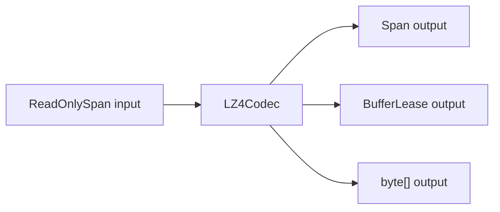

# LZ4

This page covers the public compression surface in `Nalix.Shared.LZ4`.

## Source mapping

- `src/Nalix.Shared/LZ4/LZ4Codec.cs`
- `src/Nalix.Shared/LZ4/LZ4BlockHeader.cs`
- `src/Nalix.Shared/LZ4/Encoders/*`
- `src/Nalix.Shared/LZ4/Engine/*`

## Main types

- `LZ4Codec`
- `LZ4BlockHeader`

## What it does

This layer provides:

- block compression into a caller-supplied span
- block compression into a pooled `BufferLease`
- block decompression into a caller-supplied span
- block decompression into a rented `BufferLease`
- block decompression into a new `byte[]`

## Runtime shape



## Block format

Compressed payloads include an `LZ4BlockHeader` before the body.

The header stores:

- `OriginalLength`
- `CompressedLength`

`LZ4BlockHeader.Size` is currently `8` bytes.

## Encode overloads

`LZ4Codec.Encode(...)` supports:

- `Encode(ReadOnlySpan<byte> input, Span<byte> output)`
- `Encode(ReadOnlySpan<byte> input, out BufferLease? lease, out int bytesWritten)`

Use the span overload when you already own the destination buffer.

Use the `BufferLease` overload when you want a pooled, zero-copy-friendly path.

## Decode overloads

`LZ4Codec.Decode(...)` supports:

- `Decode(ReadOnlySpan<byte> input, Span<byte> output)`
- `Decode(ReadOnlySpan<byte> input, out byte[]? output, out int bytesWritten)`
- `Decode(ReadOnlySpan<byte> input, out BufferLease? lease, out int bytesWritten)`

Use the `byte[]` overload when convenience matters more than allocation pressure.

Use the `BufferLease` overload on hot paths where you want pooled output.

## Example

```csharp
ReadOnlySpan<byte> input = payload;

if (LZ4Codec.Encode(input, out BufferLease? compressed, out int written))
{
    using (compressed)
    {
        if (LZ4Codec.Decode(compressed.Span, out BufferLease? restored, out int restoredBytes))
        {
            using (restored)
            {
                Console.WriteLine(restoredBytes);
            }
        }
    }
}
```

## Important notes

!!! tip "Prefer pooled paths on hot routes"
    The `BufferLease` overloads are the best default when compression is part of a high-throughput network path.

!!! note "The span encode path expects enough space"
    `Encode(input, output)` returns `-1` if the destination is too small or cannot fit the header and compressed block.

## Related APIs

- [Buffer and Pooling](./buffer-and-pooling.md)
- [Serialization](./serialization.md)
- [Compression Options](../network/compression-options.md)
