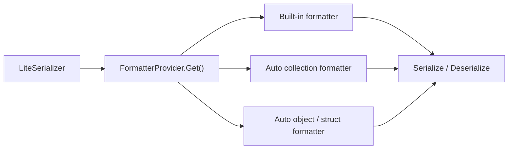

# Serialization

This page covers the public serialization surface in `Nalix.Framework.Serialization`.

## Source mapping

- `src/Nalix.Framework/Serialization/IFormatter.cs`
- `src/Nalix.Framework/Serialization/FormatterProvider.cs`
- `src/Nalix.Framework/Serialization/LiteSerializer.cs`
- `src/Nalix.Framework/Serialization/Formatters/Primitives/*`
- `src/Nalix.Framework/Serialization/Formatters/Collections/*`
- `src/Nalix.Framework/Serialization/Formatters/Automatic/*`

## Main types

- `IFormatter<T>`
- `FormatterProvider`
- `LiteSerializer`

## What it does

This layer provides:

- primitive, collection, and memory formatters
- automatic object and struct formatters
- a provider that resolves the right formatter
- a lightweight serializer entry point

## Supported type groups

The current source supports these groups directly:

- unmanaged primitives and value types
- `string` and `string[]`
- nullable value types such as `int?`, `Guid?`, `DateTime?`
- unmanaged arrays such as `int[]`, `Guid[]`, `DateTime[]`
- nullable arrays such as `int?[]`, `Guid?[]`
- enum values, enum arrays, and enum lists
- `List<T>`
- `Dictionary<TKey, TValue>`
- `Queue<T>`
- `Stack<T>`
- `HashSet<T>`
- `Memory<T>` and `ReadOnlyMemory<T>` for unmanaged element types
- `ValueTuple` arity 2 through 5
- automatic class and struct serialization through generated formatters

## Built-in primitive coverage

The provider registers built-in formatters for:

- `char`, `byte`, `sbyte`
- `short`, `int`, `long`
- `ushort`, `uint`, `ulong`
- `float`, `double`, `decimal`
- `bool`
- `Guid`
- `DateOnly`, `DateTime`, `TimeOnly`, `TimeSpan`, `DateTimeOffset`
- `UInt56`

## Collection behavior

Collection support is broader than the old docs implied:

- arrays support unmanaged, enum, nullable-value, and reference-type elements
- `List<T>` supports value, nullable-value, enum, and reference-type elements
- `Dictionary<TKey, TValue>` is supported through a dedicated formatter
- `Queue<T>`, `Stack<T>`, and `HashSet<T>` currently reject most class element types except `string`

## Automatic object and struct serialization

When no explicit formatter is registered, the provider can create formatters for:

- classes through `ObjectFormatter<T>` or `NullableObjectFormatter<T>`
- structs through `StructFormatter<T>`

Types marked with `SerializePackableAttribute` are treated as explicitly packable and skip the nullable-object wrapper path.

## Important limits

!!! note "Some collection shapes are intentionally restricted"
    `Memory<T>` and `ReadOnlyMemory<T>` only support unmanaged element types.
    `Queue<T>`, `Stack<T>`, and `HashSet<T>` do not support arbitrary class elements today.
    `ValueTuple` support currently stops at arity 5.

## Basic usage

```csharp
byte[] bytes = LiteSerializer.Serialize(model);
MyModel clone = LiteSerializer.Deserialize<MyModel>(bytes);
```

## Resolution flow



## FormatterProvider

`FormatterProvider` is the registry/resolution layer for formatters.

Use it when you need lower-level control than `LiteSerializer`.

## Example

```csharp
IFormatter<MyModel> formatter = FormatterProvider.Get<MyModel>();
```

If you need to override the default behavior for one type, register your formatter first:

```csharp
LiteSerializer.Register(new MyCustomFormatter());
```

## Related APIs

- [Packet Registry](./packet-registry.md)
- [Built-in Frames](./built-in-frames.md)
