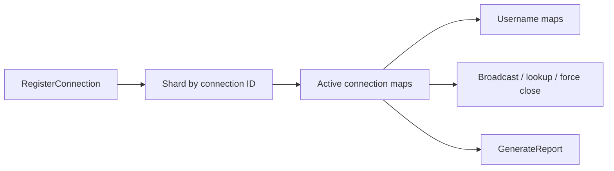

# Connection Hub

`ConnectionHub` is the central in-memory registry for live `IConnection` instances in Nalix.Network. It shards connections across multiple dictionaries, keeps username mappings, supports broadcast and forced disconnect flows, and exposes runtime diagnostics.

!!! tip "Use the hub as the session registry"
    If your server needs lookups, broadcasts, username association, or force-close behavior, keep that logic centered on `ConnectionHub` instead of scattering separate connection maps across the app.

## Hub model



## Source mapping

- `src/Nalix.Network/Connections/Connection.Hub.cs`
- `src/Nalix.Network/Connections/Connection.Hub.Statistics.cs`
- `src/Nalix.Network/Connections/Connection.Hub.EventArgs.cs`
- `src/Nalix.Network/Configurations/ConnectionHubOptions.cs`

## Core design

- Connections are distributed across internal shards using the connection ID hash.
- Usernames are tracked in two maps:
  - `ID -> username`
  - `username -> ID`
- Anonymous connections are also queued in FIFO order so `DROP_OLDEST` can evict them efficiently.
- `Statistics` returns a structured snapshot with connection count, drop policy, shard count, anonymous queue depth, evicted count, and rejected count.

## Main operations

| Method | Purpose |
|---|---|
| `RegisterConnection(connection)` | Adds a connection and subscribes the close event. |
| `UnregisterConnection(connection)` | Removes the connection, username mapping, and event subscription. |
| `AssociateUsername(connection, username)` | Applies trim/length/regex rules and stores the username mapping. |
| `GetConnection(id)` / `GetConnection(username)` | Resolves an active connection. |
| `ListConnections()` | Returns a snapshot of active connections. |
| `BroadcastAsync(...)` | Sends to all active connections. |
| `BroadcastWhereAsync(...)` | Sends to matching connections only. |
| `ForceClose(endpoint)` | Disconnects all matching connections by address. |
| `CloseAllConnections(reason)` | Disconnects everything in parallel. |
| `GenerateReport()` | Returns a runtime summary string. |

## Capacity behavior

When `MaxConnections` is reached:

- `DROP_NEWEST` disconnects the incoming connection and increments rejected count.
- `DROP_OLDEST` searches the anonymous FIFO for an evictable connection and disconnects it.

In both cases the hub raises `CapacityLimitReached`.

## Broadcast behavior

- `BroadcastBatchSize > 0` enables batched `Task.WhenAll(...)` fan-out.
- Without batching, the hub partitions the connection list and processes partitions in parallel.
- `ParallelDisconnectDegree` controls bulk disconnect parallelism.

## Username rules

`AssociateUsername(...)` currently:

- ignores null/whitespace usernames
- optionally trims according to `TrimUsernames`
- truncates to `MaxUsernameLength`
- only accepts `^[a-zA-Z0-9_]+$`

## Diagnostics

`GenerateReport()` includes:

- total, anonymous, and authenticated connection counts
- evicted and rejected counts
- shard count and anonymous queue depth
- configured max connection count and drop policy
- bytes sent and uptime aggregates
- per-status and per-algorithm summaries
- the first 15 active connections with usernames

## Basic usage

```csharp
hub.RegisterConnection(connection);
hub.AssociateUsername(connection, "sample_user");

IConnection? sameConnection = hub.GetConnection(connection.ID);
await hub.BroadcastAsync(new PingResponse(), ct);
```

## Related APIs

- [Connection](./connection.md)
- [Connection Events](./connection-events.md)
- [Connection Hub Options](./connection-hub-options.md)
- [Network Options](./options.md)
