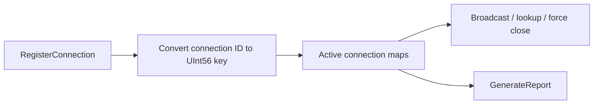

# Connection Hub

`ConnectionHub` is the central in-memory registry for live `IConnection` instances in Nalix.Network. It shards connections across multiple dictionaries, supports broadcast and forced disconnect flows, and exposes runtime diagnostics.

!!! tip "Use the hub as the session registry"
    If your server needs lookups, broadcasts, or force-close behavior, keep that logic centered on `ConnectionHub` instead of scattering separate connection maps across the app.

## Hub model



## Source mapping

- `src/Nalix.Network/Connections/Connection.Hub.cs`
- `src/Nalix.Network/Connections/Connection.Hub.Statistics.cs`
- `src/Nalix.Network/Connections/Connection.Hub.EventArgs.cs`
- `src/Nalix.Network/Configurations/ConnectionHubOptions.cs`

## Core design

- Connections are distributed across internal shards using a compact `UInt56` key derived from `connection.ID`.
- Anonymous connections are also queued in FIFO order so `DROP_OLDEST` can evict them efficiently.
- `Statistics` returns a structured snapshot with connection count, drop policy, shard count, anonymous queue depth, evicted count, and rejected count.

## Keying model

The current hub stores each connection under `connection.ID.ToUInt56()`.

That means:

- shard selection is based on the serialized snowflake key, not the reference identity of the `ISnowflake` object
- `GetConnection(ISnowflake id)` and `GetConnection(ReadOnlySpan<byte> id)` resolve through the same `UInt56` lookup path
- UDP listener code can resolve a connection directly from the session ID bytes appended to the datagram

## Main operations

| Method | Purpose |
|---|---|
| `RegisterConnection(connection)` | Adds a connection and subscribes the close event; throws if the hub is disposed, full, or the connection is already registered. |
| `UnregisterConnection(connection)` | Removes the connection and event subscription; throws if the hub is disposed or the connection is not registered. |
| `GetConnection(id)` | Resolves an active connection. |
| `ListConnections()` | Returns a snapshot of active connections. |
| `BroadcastAsync(...)` | Sends to all active connections. |
| `BroadcastWhereAsync(...)` | Sends to matching connections only. |
| `ForceClose(endpoint)` | Disconnects all matching connections by address. |
| `CloseAllConnections(reason)` | Disconnects everything in parallel. |
| `GenerateReport()` | Returns a runtime summary string. |

## Capacity behavior

When `MaxConnections` is reached:

- `DROP_NEWEST` disconnects the incoming connection and increments rejected count.
- `DROP_OLDEST` searches the anonymous FIFO for an evictable connection and disconnects it.

In both cases the hub raises `CapacityLimitReached`.

`RegisterConnection(...)` no longer returns a boolean status. Admission failures now surface as `InvalidOperationException`, which keeps duplicate registrations and over-capacity cases explicit for callers.

## Broadcast behavior

- `BroadcastBatchSize > 0` enables batched `Task.WhenAll(...)` fan-out.
- Without batching, the hub partitions the connection list and processes partitions in parallel.
- `ParallelDisconnectDegree` controls bulk disconnect parallelism.

## Diagnostics

`GenerateReport()` includes:

- total and anonymous connection counts
- evicted and rejected counts
- shard count and anonymous queue depth
- configured max connection count and drop policy
- bytes sent and uptime aggregates
- per-status and per-algorithm summaries
- the first 15 active connections

## ConnectionHubStatistics

`ConnectionHubStatistics` is the structured snapshot returned by the hub for quick diagnostics and monitoring.

## Source mapping

- `src/Nalix.Network/Connections/Connection.Hub.Statistics.cs`

It exposes:

- `ConnectionCount`
- `MaxConnections`
- `DropPolicy`
- `ShardCount`
- `AnonymousQueueDepth`
- `EvictedConnections`
- `RejectedConnections`

Use this type when you need machine-readable hub state instead of the formatted `GenerateReport()` output.

## Basic usage

```csharp
hub.RegisterConnection(connection);
IConnection? sameConnection = hub.GetConnection(connection.ID);
await hub.BroadcastAsync(new Control(), ct);
```

```csharp
ConnectionHubStatistics stats = hub.Statistics;
int liveConnections = stats.ConnectionCount;
int rejectedConnections = stats.RejectedConnections;
```

---

## Associating username with a connection (new pattern)

If you need to store the username for a connection, use the `Attributes` map on each `IConnection` instance:

```csharp
// Set username
connection.Attributes["username"] = "sample_user";

// Lookup username from connection
var username = connection.Attributes.TryGetValue("username", out var u) ? u as string : null;
```

> There is no built-in reverse mapping from username to connection;
> if you need to find a connection by username, perform a linear scan over the list of connections:
>
> ```csharp
> var userConn = hub.ListConnections()
>     .FirstOrDefault(c => c.Attributes.TryGetValue("username", out var u) && (u as string) == "my_user");
> ```

**Username can still be validated/truncated on assignment according to your business rules.**

## Related APIs

- [Connection](./connection.md)
- [Connection Events](./connection-events.md)
- [Connection Hub Options](./connection-hub-options.md)
- [UDP Listener](../runtime/udp-listener.md)
- [Network Options](../options/options.md)
