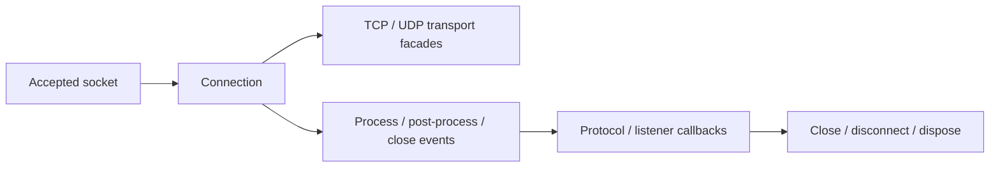

# Connection

`Connection` is the default `IConnection` implementation used by Nalix.Network after a socket is accepted. It wraps the framed socket transport, owns connection identity and endpoint information, exposes TCP/UDP adapters, and bridges low-level transport callbacks into the higher-level events consumed by listeners, protocols, and dispatch code.

!!! note "Treat connection state as live session state"
    `Connection` is not just a socket wrapper.
    It carries identity, permission, transport helpers, and runtime counters that other network components depend on.

## Lifecycle overview



## Source mapping

- `src/Nalix.Network/Connections/Connection.cs`
- `src/Nalix.Network/Connections/Connection.Extensions.cs`
- `src/Nalix.Network/Connections/Connection.Transmission.cs`
- `src/Nalix.Network/Connections/Connection.EventArgs.cs`
- `src/Nalix.Network/Connections/Connection.Endpoint.cs`

## Core state

| Member | Meaning |
|--------|---------|
| `ID` | Snowflake session ID created at construction time. |
| `NetworkEndpoint` | Remote endpoint resolved from the accepted socket. |
| `TCP` | Always-present TCP transport facade backed by `SocketConnection`. |
| `UDP` | UDP transport facade when provisioned by the connection. |
| `Secret` | Session secret / keying material. |
| `Algorithm` | Current cipher suite, defaulting to `CHACHA20_POLY1305`. |
| `Level` | Permission level for authorization-sensitive handlers. |
| `BytesSent` | Total transmitted bytes, read atomically. |
| `ErrorCount` | Number of transport / dispatch errors recorded for this connection. |
| `UpTime`, `LastPingTime` | Metrics exposed through the framed socket cache. |
| `Attributes`        | **ObjectMap** storing arbitrary session metadata as key/value pairs (user data/context/etc).  |

### Attributes (ObjectMap)

The `Attributes` property is an `ObjectMap<string, object>` allocated with every Connection, meant for storing arbitrary metadata (key/value pairs) relevant to the session: user data, flags, tokens, auxiliary context, etc.

- **Type:** `IObjectMap<string, object>`
- **Lifetime:** Automatically managed and returned to its pool when the Connection is disposed, for optimal memory usage.
- **Usage Examples:**

    ```csharp
    // Store a user name
    connection.Attributes["UserName"] = "phcnguyen";

    // Retrieve a value
    if (connection.Attributes.TryGetValue("UserName", out var user))
    {
        var name = user.ToString();
    }

    // Remove a key
    connection.Attributes.Remove("UserName");
    ```

## Event bridges

The connection exposes three events:

- `OnCloseEvent`
- `OnProcessEvent`
- `OnPostProcessEvent`

These are bridged from `SocketConnection.SetCallback(...)`:

- close callbacks use `AsyncCallback.InvokeHighPriority(...)`
- process and post-process callbacks use `AsyncCallback.Invoke(...)`

`_closeSignaled` ensures the close event is emitted only once.

## Lifecycle

- Construction creates the session ID, resolves the remote endpoint, creates `ConnectionEventArgs`, and initializes `SocketConnection`.
- `Close(force = false)` forwards to the close bridge.
- `Disconnect(reason)` currently aliases `Close(force: true)`.
- `Dispose()` marks the instance disposed, disconnects, disposes the framed socket, and returns any pooled UDP transport to `ObjectPoolManager`.

## Directive sending helper

`ConnectionExtensions.SendAsync(...)` sends a protocol `Directive` over TCP.

Current behavior:

- rents a pooled `Directive`
- serializes into a rented `BufferLease`
- sends through `connection.TCP.SendAsync(...)`
- lets transport exceptions surface if the send cannot complete
- always returns the directive to the pool in a `finally` block

Use this helper for throttle, fail, timeout, or other control replies.

## Integration

- `TcpListenerBase` subscribes protocol and limiter handlers to the connection events.
- `Protocol.ProcessMessage` and `Protocol.PostProcessMessage` usually attach to the process events.
- `ConnectionLimiter.OnConnectionClosed` should be attached to `OnCloseEvent` so per-endpoint counters stay accurate.

## Transport implementation details

If you want the lower-level TCP framing, receive loop, callback wiring, fragmentation, and send-path behavior behind `connection.TCP`, see [Socket Connection](../runtime/socket-connection.md).

## Basic usage

```csharp
connection.OnProcessEvent += protocol.ProcessMessage;
connection.OnPostProcessEvent += protocol.PostProcessMessage;

await connection.TCP.SendAsync(new Control(), ct);
connection.Close();
```

## Related APIs

- [TcpListener](../runtime/tcp-listener.md)
- [Connection Hub](./connection-hub.md)
- [Connection Events](./connection-events.md)
- [Connection Extensions](./connection-extensions.md)
- [Socket Connection](../runtime/socket-connection.md)
- [Connection Contracts](../../common/connection-contracts.md)
- [Packet Dispatch](../../routing/packet-dispatch.md)
