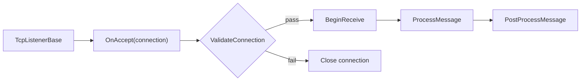

# Protocol

`Protocol` is the base abstraction that `TcpListenerBase` calls for connection acceptance and per-message processing. It centralizes accepting-state, connection validation, post-processing, auto-disconnect policy, error counting, and a small runtime report surface.

!!! tip "Keep protocols thin"
    A good protocol mostly accepts traffic, starts receive flow, and forwards messages into dispatch.
    If protocol code starts owning business policy, handlers and middleware usually become harder to reason about.

## Flow overview



## Source mapping

- `src/Nalix.Network/Protocols/Protocol.Core.cs`
- `src/Nalix.Network/Protocols/Protocol.PublicMethods.cs`
- `src/Nalix.Network/Protocols/Protocol.Lifecycle.cs`
- `src/Nalix.Network/Protocols/Protocol.Metrics.cs`

## Required contract

Derived types must implement:

```csharp
public abstract void ProcessMessage(object sender, IConnectEventArgs args);
```

This is the main per-message handler in the connection event pipeline.

## Acceptance flow

`OnAccept(connection, ct)` currently:

- rejects immediately if `IsAccepting` is false
- validates null, disposed, and cancellation state
- calls `ValidateConnection(connection)`
- if validation passes, starts `connection.TCP.BeginReceive(ct)`
- if validation fails, closes the connection
- on unexpected errors, calls `OnConnectionError(...)` and disconnects

## Post-process flow

`PostProcessMessage(sender, args)`:

- calls `OnPostProcess(args)`
- increments `TotalMessages`
- disconnects the connection when `KeepConnectionOpen` is false
- on exceptions, increments `TotalErrors`, calls `OnConnectionError(...)`, and disconnects

`KeepConnectionOpen` is backed by an atomic field and defaults to `false`.

## Extensibility points

- `ValidateConnection(IConnection)` for pre-receive admission checks
- `OnPostProcess(IConnectEventArgs)` for after-handler logic
- `OnConnectionError(IConnection, Exception)` for protocol-level error handling
- `Dispose(bool)` for releasing derived resources

## Operational controls

- `SetConnectionAcceptance(bool)` toggles whether new connections are accepted.
- `IsAccepting` is stored atomically.
- `Dispose()` marks the protocol disposed and suppresses finalization.

## Basic usage

```csharp
protocol.SetConnectionAcceptance(true);
await protocol.OnAccept(connection, ct);
```

## Diagnostics

`GenerateReport()` includes:

- disposed flag
- `TotalMessages`
- `TotalErrors`
- `IsAccepting`
- `KeepConnectionOpen`

## Related APIs

- [Tcp Listener](./tcp-listener.md)
- [Connection](../connection/connection.md)
- [Connection Contracts](../../common/connection-contracts.md)
- [Packet Dispatch](../../routing/packet-dispatch.md)
