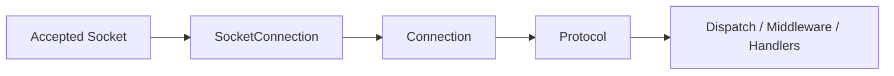

# Socket Connection

`SocketConnection` is the internal TCP framing and transport engine behind `Connection.TCP`.

It is not the main application-facing abstraction. The normal public entry point is still `Connection`, but this type is where framed send/receive, callback bridging, fragmentation, and connection-local throttling actually happen.

## Source mapping

- `src/Nalix.Network/Internal/Transport/SocketConnection.cs`
- `src/Nalix.Network/Internal/Transport/SocketConnection.Send.cs`

## Role in the stack



`Connection` owns identity, endpoint state, transports, and high-level events.

`SocketConnection` owns:

- framed TCP send and receive
- pooled receive context setup
- callback registration through `SetCallback(...)`
- chunk reassembly via `FragmentAssembler`
- per-connection pending-packet throttling
- shutdown and cleanup of socket-side resources

## Core state

Important source members:

- `_socket` for the accepted connected socket
- `_recvCtx` for the pooled SAEA-backed receive context
- `_buffer` for the reusable receive buffer
- `_fragmentAssembler` for fragmented payload reassembly
- `_pendingProcessCallbacks` for per-connection flood protection
- `_openFragmentStreams` for limiting parallel fragmented streams
- `_cts` for linked shutdown and receive cancellation

## Callback setup

Before use, `Connection` calls:

```csharp
_socket = new SocketConnection(socket);
_socket.SetCallback(this, _args, this.OnCloseEventBridge, OnPostProcessEventBridge, OnProcessEventBridge);
```

`SetCallback(...)` stores:

- the owning `IConnection`
- cached event args
- close callback
- post-process callback
- process callback

`BeginReceive(...)` will throw if `SetCallback(...)` was not called first.

## Receive path

`BeginReceive(...)` starts the receive loop exactly once and rents a `PooledSocketReceiveContext` from `ObjectPoolManager`.

The receive flow is:

1. read the 2-byte little-endian frame length
2. validate against `PacketConstants.PacketSizeLimit`
3. grow the receive buffer only when needed
4. read the full payload
5. evict stale fragment streams periodically
6. apply per-connection pending-packet throttle
7. hand off either a full frame or a reassembled fragmented payload to `AsyncCallback`

### Fragment handling

When the payload starts with a valid `FragmentHeader`:

- `FragmentAssembler.Add(...)` collects chunk bodies
- completed streams become a reassembled `BufferLease`
- `MaxPerConnectionOpenFragmentStreams` limits concurrent fragment streams per connection
- stale streams are evicted every `EvictInterval`
- invalid or out-of-order fragment sequences now throw instead of being folded into a boolean result

## Send path

`SocketConnection` supports:

- `Send(ReadOnlySpan<byte>)`
- `SendAsync(ReadOnlyMemory<byte>, CancellationToken)`

Both methods now return `void` and signal failures by throwing exceptions.

### Normal framed send

For regular packets it:

- prepends a 2-byte little-endian frame length
- uses stackalloc for small packets
- uses pooled heap buffers for larger packets
- invokes the post-process callback after a successful send
- throws when the socket is disposed, the payload is empty, or a partial send occurs

### Fragmented send

If payload size is at or above `FragmentOptions.ChunkThreshold`, the send path switches into chunked mode.

That path:

- allocates a `FragmentStreamId`
- splits payload by `ChunkBodySize`
- prepends a `FragmentHeader` to each chunk
- emits one normal outer frame per fragment

## Connection-local pressure control

The receive loop enforces a hard cap with `MaxPerConnectionPendingPackets`.

If one connection floods packets faster than processing can drain them:

- new packets are dropped before they reach the broader callback pipeline
- the connection buffer is returned to the pool immediately
- the loop keeps running instead of stalling the whole server

This is intentionally a first-line per-connection shield, not the higher-level admission or policy limiter.

## Shutdown and disposal

`Dispose()`:

- cancels the receive loop once
- shuts down and closes the socket
- returns `_recvCtx` to the object pool
- returns the receive buffer to the byte pool
- invokes the close callback once
- disposes the cancellation source, socket, and fragment assembler

The implementation uses one-time guards such as `_disposed`, `_closeSignaled`, `_receiveStarted`, and `_cancelSignaled` so cleanup paths do not run twice.

## When to care about this type

Read this page when you need to understand:

- how TCP frames are actually read and written
- where fragmented payloads are assembled
- why a packet may be dropped before dispatch
- what callback order `Connection` depends on
- what disposal does to in-flight receive work

If you are writing handlers, middleware, or protocol logic, start with `Connection` instead.

## Related APIs

- [Connection](../connection/connection.md)
- [Protocol](./protocol.md)
- [TCP Listener](./tcp-listener.md)
- [Fragmentation](../../framework/packets/fragmentation.md)
- [Buffer and Pooling](../../framework/memory/buffer-and-pooling.md)
