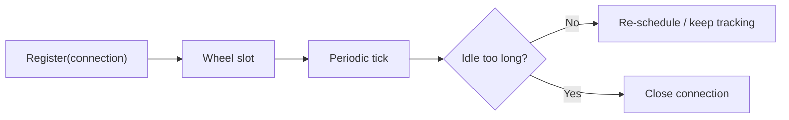

# Timing Wheel

`TimingWheel` is the idle-timeout scheduler used by the network runtime.

## Timeout flow



## Source mapping

- `src/Nalix.Network/Timekeeping/TimingWheel.cs`

## What it does

- tracks registered connections
- closes idle connections after the configured timeout
- uses a hashed-wheel structure instead of scanning all connections every tick
- reuses pooled timeout tasks for lower allocation pressure

## Basic usage

```csharp
TimingWheel wheel = InstanceManager.Instance.GetOrCreateInstance<TimingWheel>();

wheel.Activate();
wheel.Register(connection);
```

When a connection closes, it should be unregistered so the wheel stops tracking it.

## Related settings

`TimingWheel` reads:

- `TimingWheelOptions`
- `PoolingOptions`

## Related APIs

- [TimingWheelOptions](../options/timing-wheel-options.md)
- [PoolingOptions](../options/pooling-options.md)
- [Connection](../connection/connection.md)
