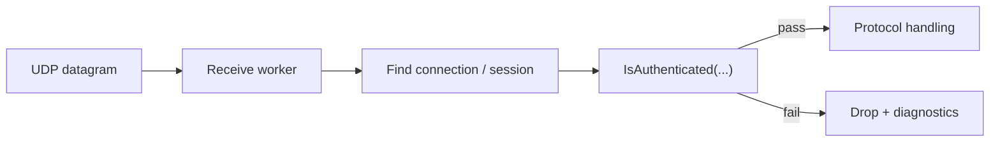

# Udp Listener

`UdpListenerBase` is the base class for UDP-based listeners in Nalix.Network. It owns the `UdpClient`, activation and deactivation flow, datagram receive worker, protocol integration, authentication hook, time-sync wiring, and runtime counters used in diagnostics.

!!! caution "UDP is not a shortcut around session security"
    In Nalix, UDP should usually extend an already trusted session model.
    If you do not have a clear session and authentication story yet, start with TCP first.

## Datagram flow



## Source mapping

- `src/Nalix.Network/Listeners/UdpListener/UdpListener.Core.cs`
- `src/Nalix.Network/Listeners/UdpListener/UdpListener.PublicMethods.cs`
- `src/Nalix.Network/Listeners/UdpListener/UdpListener.PrivateMethods.cs`
- `src/Nalix.Network/Listeners/UdpListener/UdpListener.Receive.cs`
- `src/Nalix.Network/Listeners/UdpListener/UdpListener.SocketConfig.cs`

## Lifecycle

`Activate(ct)`:

- throws if disposed
- initializes the UDP socket if needed
- creates a linked cancellation source
- marks the listener as running
- schedules a background receive worker through `TaskManager`

`Deactivate(ct)`:

- cancels the CTS
- closes and nulls the `UdpClient`
- resets running state

`Dispose()`:

- cancels and disposes the CTS
- closes the UDP socket
- unsubscribes from `TimeSynchronizer`
- disposes the internal semaphore lock

## Extensibility points

- `IsAuthenticated(IConnection connection, in UdpReceiveResult result)` is required and decides whether an inbound datagram is accepted.
- `OnTimeSynchronized(serverMs, localMs, driftMs)` is optional and lets derived listeners react to time drift updates.

## Diagnostics tracked in code

The class keeps counters for:

- received packets and bytes
- short-packet drops
- unauthenticated drops
- unknown-packet drops
- receive errors
- last synchronized Unix milliseconds
- last measured local drift

`GenerateReport()` prints listener state, socket settings, worker-group details, time-sync stats, traffic counters, error counts, and whether the live `UdpClient` and `CancellationTokenSource` currently exist.

## Notes

- `Activate(...)` is currently marked `[Obsolete]` in source, so treat the API as legacy but supported.
- `IsTimeSyncEnabled` cannot be changed while the listener is running.
- The scheduled worker uses `NetworkSocketOptions.MaxGroupConcurrency` as its concurrency limit.

!!! tip "Keep authentication fast"
    `IsAuthenticated(...)` should be deterministic and cheap.
    Expensive lookups or slow policy checks belong in a safer layer upstream of sustained UDP traffic.

## Basic usage

```csharp
var protocol = new SampleProtocol();
var listener = new SampleUdpListener(protocol);

await listener.Activate(ct);
Console.WriteLine(listener.GenerateReport());
```

## Related APIs

- [Protocol](./protocol.md)
- [Network Options](./options.md)
