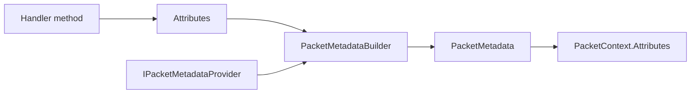

# Packet Metadata

`PacketMetadata` is the descriptor Nalix.Network builds for each handler method. It is the bridge between attributes on your handler and the runtime behavior applied by dispatch, middleware, rate limiting, permissions, timeout handling, and encryption rules.

!!! note "Metadata is runtime behavior, not decoration"
    Packet attributes become real dispatch and middleware rules.
    If middleware is behaving differently than expected, metadata resolution is one of the first places to inspect.

## Build overview



## Source mapping

- `src/Nalix.Network/Routing/Metadata/PacketMetadata.cs`
- `src/Nalix.Network/Routing/PacketMetadataBuilder.cs`
- `src/Nalix.Network/Routing/PacketMetadataProviders.cs`
- `src/Nalix.Network/Routing/IPacketMetadataProvider.cs`

## What lives in metadata

`PacketMetadata` can hold:

- `PacketOpcode`
- `Timeout`
- `Permission`
- `Encryption`
- `RateLimit`
- `ConcurrencyLimit`
- custom attributes stored by concrete type

This is the data that middleware and dispatch logic read later through `PacketContext.Attributes`.

## Build flow

The runtime flow is:

1. handler methods are inspected
2. attributes are copied into `PacketMetadataBuilder`
3. registered `IPacketMetadataProvider` instances can add more metadata
4. `Build()` produces an immutable `PacketMetadata`
5. the descriptor is attached to the compiled handler and later exposed through `PacketContext`

## PacketHandler<TPacket>

`PacketHandler<TPacket>` is the runtime descriptor that pairs handler metadata with the compiled invocation delegate.

## Source mapping

- `src/Nalix.Network/Routing/Metadata/PacketHandler.cs`

It carries:

- `OpCode`
- `Metadata`
- `Instance`
- `MethodInfo`
- `ReturnType`
- `Invoker`

This is the object the dispatch layer actually executes after metadata resolution is complete.

## Execution model

`PacketHandler<TPacket>` is designed so dispatch can avoid reflection in the hot path:

- metadata is resolved once up front
- the controller instance is cached
- a compiled delegate is stored in `Invoker`
- `ExecuteAsync(context)` runs through that delegate

That makes `PacketHandler<TPacket>` the bridge between reflection-time discovery and runtime packet execution.

## PacketMetadataBuilder

`PacketMetadataBuilder` is the mutable assembly step before the final descriptor is created.

It:

- stores the standard built-in packet attributes
- lets providers add custom attributes through `Add(attribute)`
- lets later code resolve custom values with `Get<TAttribute>()`
- requires a non-null `PacketOpcodeAttribute` before `Build()`

## Metadata providers

`IPacketMetadataProvider` lets you contribute metadata programmatically:

## Example

```csharp
public interface IPacketMetadataProvider
{
    void Populate(MethodInfo method, PacketMetadataBuilder builder);
}
```

Register providers globally through `PacketMetadataProviders.Register(...)`.

Use a provider when:

- you want conventions instead of repeating attributes everywhere
- you want to attach custom attributes based on namespace, naming, or reflection rules
- you need shared policy injection without editing every handler

## Custom attributes

Custom metadata is stored in a read-only dictionary keyed by attribute type.

At runtime:

```csharp
MyCustomAttribute? attr = context.Attributes.GetCustomAttribute<MyCustomAttribute>();
```

This keeps the standard packet flow extensible without changing the base `PacketMetadata` shape every time.

## When clients should care

You usually care about this page when you are:

- building custom conventions
- writing middleware that depends on packet attributes
- trying to understand how `PacketContext.Attributes` is populated

## Related APIs

- [Packet Attributes](./packet-attributes.md)
- [Packet Context](./packet-context.md)
- [Packet Dispatch](./packet-dispatch.md)
- [Dispatch Channel and Router](./dispatch-channel-and-router.md)
