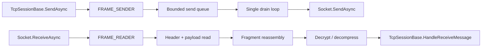

# Frame Reader and Sender

This page documents the internal framing helpers behind `TcpSessionBase` and `TcpSession`.

!!! note "Transport implementation details"
    `FRAME_READER` and `FRAME_SENDER` are internal SDK helpers, not the main client abstraction.
    Most consumers should work through `TcpSession` or `IoTTcpSession`, but these types are useful when you need to understand send ordering, receive ownership, fragmentation, or reconnect behavior.

## Source mapping

- `src/Nalix.SDK/Transport/Internal/FRAME_READER.cs`
- `src/Nalix.SDK/Transport/Internal/FRAME_SENDER.cs`
- `src/Nalix.SDK/Transport/TcpSessionBase.cs`
- `src/Nalix.SDK/Transport/TcpSession.cs`

## Runtime model

## FRAME_SENDER

`FRAME_SENDER` is the single-writer send pipeline used by `TcpSessionBase.SendAsync(...)`.

Its job is to:

- frame outbound payloads with the 2-byte SDK length header
- queue concurrent sends through a bounded channel
- ensure only one drain loop writes to the socket
- return rented buffers after the send completes
- report send failures back to the session

## Queue model

Important behavior:

- queue capacity is fixed by `SendQueueCapacity`
- `BoundedChannelFullMode.Wait` applies backpressure instead of dropping frames
- a single drain loop serializes all socket writes
- each queued item carries the framed bytes and a `TaskCompletionSource<bool>` so callers can await completion

This means concurrent callers never interleave bytes on the socket.

## Fragmented send path

If the payload crosses the configured fragmentation threshold, `FRAME_SENDER`:

- allocates a stream ID through `FragmentStreamId`
- slices the payload into chunk bodies
- prepends `FragmentHeader`
- enqueues each framed chunk in order

The sender still preserves ordering because all chunks eventually pass through the same drain loop.

## FRAME_READER

`FRAME_READER` is the receive-side counterpart. It owns the socket read loop and converts raw bytes back into complete frames.

Its job is to:

- read the 2-byte SDK length header
- rent a payload buffer
- copy the header back into the rented frame
- detect fragmented frames
- reassemble full payloads through `FragmentAssembler`
- decrypt and decompress after reassembly
- deliver the finished `BufferLease` upward

## Ownership model

Ownership is important on the receive path:

- `FRAME_READER` creates the `BufferLease`
- if the frame is fragmented, chunk data is copied into the assembler and the chunk lease is disposed immediately
- for a complete frame, `FRAME_READER` passes the lease to the session callback
- the upper layer becomes the sole owner and must dispose it

This is why `TcpSessionBase.HandleReceiveMessage(...)` is careful about lease copies, event dispatching, and final cleanup.

## Interaction with TcpSessionBase

`TcpSessionBase` wires these helpers together:

- `InitializeFrame()` creates `FRAME_SENDER` and `FRAME_READER`
- `SendAsync(ReadOnlyMemory<byte>)` and `SendAsync(IPacket)` forward into `FRAME_SENDER`
- `HandleReceiveMessage(BufferLease)` is the normal callback target for `FRAME_READER`
- send/receive errors are surfaced back through `HandleSendError(...)` and `HandleReceiveError(...)`

`TcpSession` then layers on:

- TaskManager-backed receive scheduling
- reconnect handling
- heartbeat and bandwidth sampling through `SessionMonitor`

## When clients should care

You usually care about this page when you are:

- debugging send ordering issues
- tracing why fragmented payloads are delayed until complete
- reasoning about who owns a receive buffer
- investigating reconnects after send/receive faults

## Related APIs

- [TCP Session](./tcp-session.md)
- [TCP Session Extensions](./tcp-session-extensions.md)
- [Fragmentation](../framework/packets/fragmentation.md)
- [Buffer and Pooling](../framework/memory/buffer-and-pooling.md)
