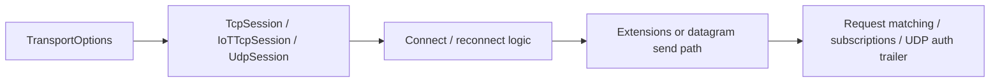

# Nalix.SDK API Overview

`Nalix.SDK` is the client transport layer for Nalix-based applications. The current source tree includes reliable TCP sessions, a UDP client session, and helper extensions for control packets, requests, directives, and handshakes.

!!! tip "Start with TcpSession unless you have a reason not to"
    `TcpSession` is the best default for most clients because it already carries reconnect, monitoring, and helper flow that teams usually need.

## Client runtime shape



## Source mapping

- `src/Nalix.SDK/Transport/TcpSessionBase.cs`
- `src/Nalix.SDK/Transport/TcpSession.cs`
- `src/Nalix.SDK/Transport/IoTTcpSession.cs`
- `src/Nalix.SDK/Transport/UdpSession.cs`
- `src/Nalix.SDK/Configuration/TransportOptions.cs`
- `src/Nalix.SDK/Configuration/RequestOptions.cs`
- `src/Nalix.SDK/Transport/Extensions/ControlExtensions.cs`
- `src/Nalix.SDK/Transport/Extensions/DirectiveClientExtensions.cs`
- `src/Nalix.SDK/Transport/Extensions/RequestExtensions.cs`
- `src/Nalix.SDK/Transport/Extensions/TcpSessionSubscriptions.cs`

## Module summary

| Component | Description |
| --- | --- |
| `TcpSessionBase`, `TcpSession`, `IoTTcpSession` | Shared TCP transport base plus two client implementations. |
| `UdpSession` | UDP client transport type that is currently marked obsolete/unsupported in source. |
| `TransportOptions` | Client transport configuration loaded through `ConfigurationManager`. |
| `RequestOptions` | Timeout, retry, and encryption controls for `RequestAsync`. |
| `Transport.Extensions` | Control, directive, request, and subscription helpers. |
| `ProtocolStringExtensions` | Friendly display text for `ProtocolAdvice` and `ProtocolReason`. |

## Quick start

Checklist:

- register an `IPacketRegistry`
- load or construct `TransportOptions`
- create `TcpSession`, `IoTTcpSession`, or `UdpSession`
- hook events you need
- connect, send, await responses, disconnect

```csharp
InstanceManager.Instance.Register<IPacketRegistry>(catalog);

TransportOptions options = ConfigurationManager.Instance.Get<TransportOptions>();

var client = new TcpSession();
client.OnConnected += (_, _) => { };
client.OnDisconnected += (_, ex) => { };

await client.ConnectAsync(options.Address, options.Port);
await client.SendAsync(myPacket);
await client.DisconnectAsync();
client.Dispose();
```

## What changed in the current runtime

Compared with older docs/examples, the current SDK shape is:

- TCP-first, but no longer TCP-only
- reconnect-aware through `TransportOptions`
- request-safe through `PACKET_AWAITER`-backed helpers
- able to handle control, directive, and request flows without hand-written boilerplate
- exposes an experimental UDP session type for datagram transport, while TCP remains the primary supported path

## ProtocolStringExtensions

`ProtocolStringExtensions` converts low-level protocol enums into short user-facing strings.

## Source mapping

- `src/Nalix.SDK/Extensions/ProtocolStringExtensions.cs`

It currently adds:

- `ProtocolAdvice.ToString()`
- `ProtocolReason.ToString()`

This API is mainly useful for:

- client UI messages
- toast/error text
- logs that should stay readable without raw enum names

## Example

```csharp
string message = ProtocolReason.RATE_LIMITED.ToString();
string action = ProtocolAdvice.BACKOFF_RETRY.ToString();
```

Use the detail pages next:

- [TCP Session](./tcp-session.md)
- [UDP Session](./udp-session.md)
- [Frame Reader and Sender](./frame-reader-and-sender.md)
- [TCP Session Extensions](./tcp-session-extensions.md)
- [Session Diagnostics](./diagnostics.md)
- [Thread Dispatching](./thread-dispatching.md)

## Related APIs

- [TCP Session](./tcp-session.md)
- [UDP Session](./udp-session.md)
- [Frame Reader and Sender](./frame-reader-and-sender.md)
- [TCP Session Extensions](./tcp-session-extensions.md)
- [Session Diagnostics](./diagnostics.md)
- [Thread Dispatching](./thread-dispatching.md)
- [Subscriptions](./subscriptions.md)
- [Transport Options](./options/transport-options.md)
- [Request Options](./options/request-options.md)
