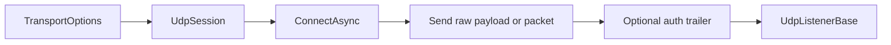

# UdpSession

`UdpSession` is the UDP client transport in `Nalix.SDK`. The type exists in source, but it is currently marked `Obsolete` and unsupported, so treat this page as reference material rather than a recommendation for new projects.

!!! tip "Treat as experimental"
    If you need to read or maintain existing UDP code, start by understanding how `BindFrom(...)` and `UseAuthenticationMetadata` work. For new work, prefer `TcpSession` unless you intentionally need to inspect this experimental path.

## Runtime shape



## Source mapping

- `src/Nalix.SDK/Transport/UdpSession.cs`

## What it does

- connects a `SocketType.Dgram` UDP socket to one remote endpoint
- reuses `TransportOptions` and `IPacketRegistry`
- serializes `IPacket` payloads and applies optional compression or encryption
- appends authenticated UDP metadata when enough session state is available
- runs a background receive loop with reconnect support
- raises the same client-style events used by the TCP sessions

## Authenticated datagram shape

When `UseAuthenticationMetadata` is enabled and both `SessionId` and a large-enough secret are available, `UdpSession` appends:

- `SessionId`
- `timestamp`
- `nonce`
- `Poly1305` authentication tag

The tag is computed from:

- payload
- session ID bytes
- timestamp bytes
- nonce bytes
- encoded remote endpoint
- the first `Poly1305.KeySize` bytes of `Options.Secret`

This matches what `UdpListenerBase` validates on the server side.

## Main entry points

| API | Purpose |
| --- | --- |
| `ConnectAsync(host, port)` | Resolves the host, connects the UDP socket, and starts the receive loop. |
| `ConnectAsync(Uri)` | Connects using a `udp://host:port` URI. |
| `BindFrom(source, sessionId)` | Copies secret and remote address from an existing authenticated client connection. |
| `SendAsync(IPacket, encrypt)` | Serializes a packet and optionally compresses/encrypts it before datagram send. |
| `SendAsync(ReadOnlyMemory<byte>)` | Sends a raw datagram payload, optionally with the auth trailer appended. |
| `DisconnectAsync()` | Tears down the socket and raises `OnDisconnected`. |

## Send path

`SendAsync(IPacket, encrypt)` follows the same transform model used by the TCP send path:

- serialize packet into a `BufferLease`
- optionally compress when `EnableCompression` and `MinSizeToCompress` allow it
- optionally encrypt with `FrameTransformer` and `Options.Secret`
- emit the final payload as one UDP datagram
- throw on invalid input, partial send, or transport errors instead of returning `false`

If `UseAuthenticationMetadata` is active and the session has enough state, `BuildDatagram(...)` appends the UDP trailer before the socket send.

## Receive path

The receive loop:

- rents a byte buffer from `BufferLease.ByteArrayPool`
- receives one datagram at a time
- copies it into a `BufferLease`
- removes `ENCRYPTED` and `COMPRESSED` transforms when flags are present
- dispatches the message to `OnMessageReceived`
- optionally copies the payload again for `OnMessageReceivedAsync`

Synchronous event handlers receive their own copied lease so they can dispose it independently.

## Reconnect behavior

On transport errors:

- `OnError` is raised first
- if `ReconnectEnabled` is true, `UdpSession` starts an exponential backoff reconnect loop
- reconnect delay uses base delay, max delay, and jitter from `Csprng`
- successful reconnect raises `OnConnected` and `OnReconnected`

Unlike `TcpSession`, UDP reconnect is just endpoint re-connect plus receive-loop restart. There is no stream rehydration step.

## Basic usage

```csharp
TransportOptions options = ConfigurationManager.Instance.Get<TransportOptions>();
IPacketRegistry registry = InstanceManager.Instance.Get<IPacketRegistry>();

var udp = new UdpSession(options, registry);
udp.BindFrom(tcpSession, sessionId);

await udp.ConnectAsync(options.Address, options.Port);
await udp.SendAsync(myPacket);
```

## When clients should care

Reach for `UdpSession` when:

- you are maintaining existing UDP code that already depends on this type
- you need to understand the authenticated datagram shape expected by `UdpListenerBase`
- you want Nalix packet transforms and diagnostics on the client side

Stay on `TcpSession` when:

- you need ordered reliable transport
- you do not yet have a UDP authentication story
- your flow depends heavily on request/response helpers

## Related APIs

- [SDK Overview](./index.md)
- [TCP Session](./tcp-session.md)
- [Frame Reader and Sender](./frame-reader-and-sender.md)
- [UDP Listener](../network/runtime/udp-listener.md)
- [UDP Auth Flow](../../guides/udp-auth-flow.md)
