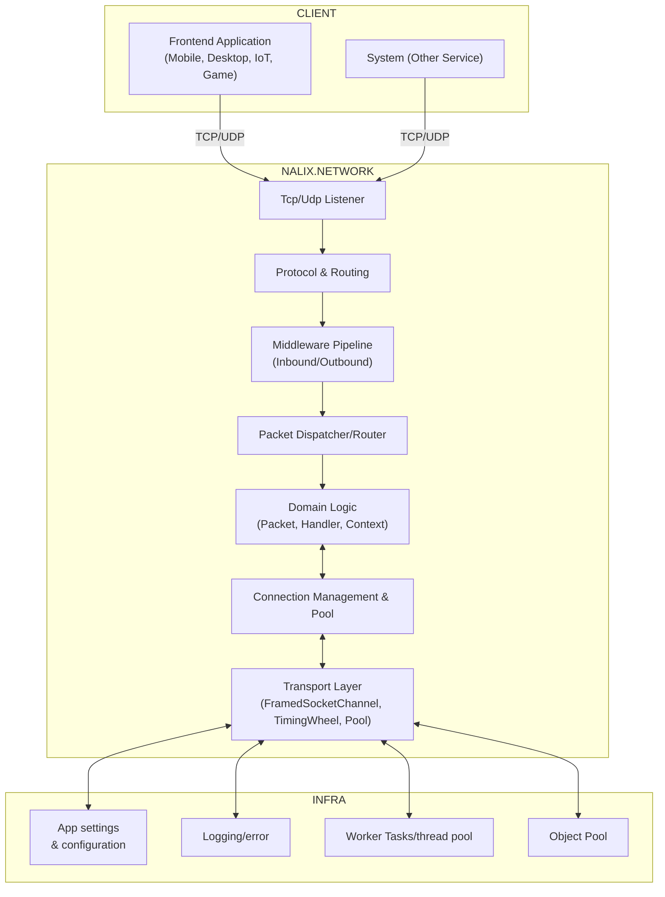
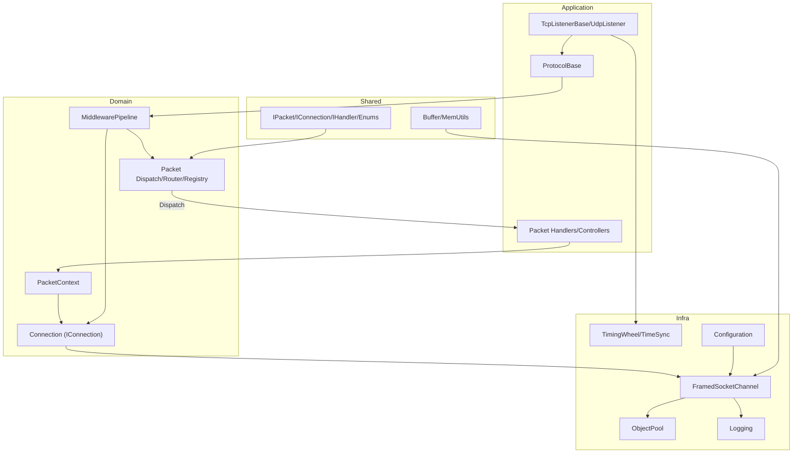
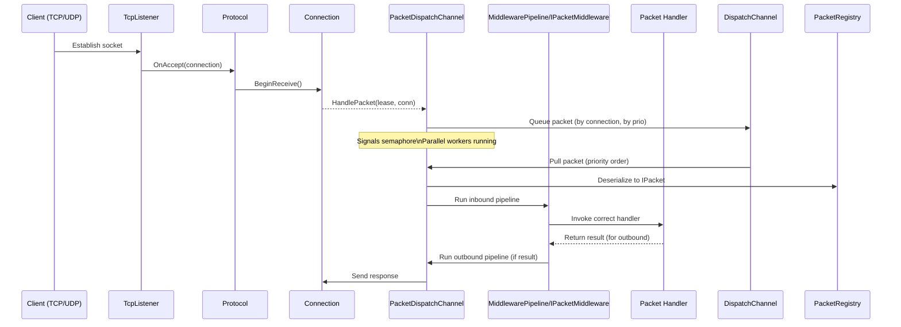
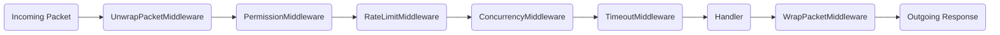
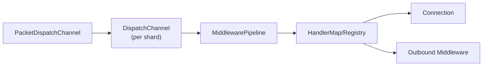
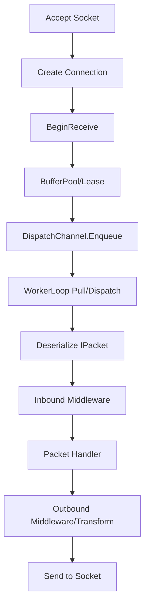

# 🧠 Architecture

## 🏁 Introduction

**Nalix.Network** is a modern, extensible .NET networking library for building high-performance TCP/UDP servers.  
It offers a robust, scalable pipeline for packet dispatch, resource management, and protocol layering—allowing applications to add domain logic, handling, and security transparently through middleware and DI-based handlers.

This document provides a detailed look at the system architecture, code layering, middleware flow, and dispatch mechanisms of Nalix.Network.

---

## 🧭 System and Layer Architecture

### 🛰️ High-Level System View

Nalix.Network is a library you embed in your server application/process for direct network transport and protocol handling.



---

### 🧱 Layered Code Structure (DDD/Clean Architecture)

#### Layer Mapping

| Layer             | Key Namespaces/Types                                                                | Function                                 |
|-------------------|-------------------------------------------------------------------------------------|------------------------------------------|
| **Application**   | Listeners, Protocols, Handler Controllers                                           | Orchestrates workflows, app entry, glue  |
| **Domain**        | Core entities: Packet, Context, Connection, MiddlewarePipeline, Handler descriptors | Business/connection logic, main contracts|
| **Infrastructure**| Internal.Transport, Pool, TimingWheel, Configuration                                | Low-level I/O, resource, timer, DI, pool |
| **Shared**        | Interfaces, Enums, MemoryUtils                                                      | Used/referenced cross-layers             |

#### Diagram



---

## 🔁 Core Flows: Packet Lifecycle

### ⚡ High-Speed Packet Dispatch with Queue Routing

The heart of packet processing is the **DispatchChannel**, **Router**, and **PacketDispatchChannel** classes:



- **DispatchChannel**: Holds packet queues per connection, tracks priority, performs thread-safe push/pull.
- **DispatchRouter**: Splits workload into “shards” based on connection id for scaling out (think per-core routing).
- **PacketDispatchChannel**: Orchestrates enqueueing, worker loop, packet deserialization, runs middleware, invokes handler, sends response.
- **MiddlewarePipeline**: Pluggable, ordered, chain-of-responsibility pipeline for cross-cutting logic.

---

### 🧩 Packet Processing Pipeline: Middleware & Handler

- **Inbound flow**:  
  `UnwrapPacketMiddleware` → `PermissionMiddleware` → `RateLimitMiddleware` → `ConcurrencyMiddleware` → `TimeoutMiddleware` → [Your Handler]
- **Outbound flow**:  
  Handler Result → `WrapPacketMiddleware` (Encrypt/Compress, etc.)



You control which middleware runs (add your own via configuration).

---

### 🚦 Packet Dispatch Channel/Router (Advanced)

- **Multi-core dispatch**: `PacketDispatchChannel` uses multiple worker loops (up to a configurable maximum, based on CPU count).
- **Per-connection queueing**: Each connection gets its own queue, supporting priority dispatch (`URGENT`, etc.).
- **Ready queues per priority**: Quickly find the highest-priority connection ready for dispatch (no O(n) scans).

---

## 🛠️ Custom Handling & Extensibility

### 🔧 Handler Composition

- Register handler classes using `[PacketController]` + `[PacketOpcode]` attributes.
- Return types supported: `void`, `Task`, `string`, custom packet, etc.
- Handlers are compiled to avoid runtime reflection.

### 🧠 DI & Configuration

- Use `WithHandler`, `WithMiddleware`, `WithErrorHandling`, `WithLogging` extension methods on your dispatch options.

```csharp
var options = new PacketDispatchOptions<IPacket>()
    .WithLogging(logger)
    .WithHandler<MyController>();

var dispatcher = new PacketDispatchChannel(opts => {
    opts.WithMiddleware(new UnwrapPacketMiddleware());
    opts.WithMiddleware(new RateLimitMiddleware());
    opts.WithHandler<CustomHandler>();
    // etc...
});
```

### 🧵 Custom Middleware

Just implement `IPacketMiddleware<TPacket>` and decorate with `[MiddlewareOrder]`, `[MiddlewareStage]` as needed:

```csharp
[MiddlewareOrder(20)]
[MiddlewareStage(MiddlewareStage.Inbound)]
public class CustomLoggingMiddleware : IPacketMiddleware<IPacket> { ... }
```

---

## 🛡️ Error Handling

- At every layer (middleware, handler, outbound): errors are caught, mapped to protocol error codes/advice, and reported to client in a consistent way.
- You can register your own error handlers via `WithErrorHandling`.

---

## 🏗️ Infrastructure Services

### 🔌 FramedSocketChannel

- Abstracts low-level socket receive/send, uses buffer pools to avoid GC.
- Implements efficient read/write, accommodates protocol frame boundaries.

### ⏱️ TimingWheel & TimeSynchronizer

- Efficient background timer for auto-disconnecting dead/idle connections (Hashed Wheel Timer pattern).
- Periodic time sync events (for “heartbeat”/liveness logic).

### 📦 Pooling, Configuration, Logging

- All heavy allocations (packets, connections, buffers, context) can be pooled.
- Centralized config and DI via `InstanceManager`, `ObjectPoolManager`, `ConfigurationManager`.

---

## ❓ FAQ / Common Customizations

- **How do I add authentication rate-limiting?**  
  → Write a `RateLimitMiddleware`, insert into pipeline before handler.

- **How do I use my own handler class for certain packets?**  
  → Annotate with `[PacketController]`, register via `.WithHandler<MyHandler>()`.

- **How do I integrate with an external database/cache?**  
  → Your handler/controller class can use DI/resolvers to get the required services.

- **How do I log packet failures?**  
  → Attach a logger via `.WithLogging()`, handle via `.WithErrorHandling()`.

- **How do I process packet priorities?**  
  → Critical packets should set their `PacketPriority` enum value on serialization. The dispatch channel proritizes accordingly.

---

## 🧭 DDD Breakdown

- **Domain**:  
  Encapsulated in `Packet`, `PacketContext`, `Handler`, Connection as business entities.  
- **Application**:  
  `Protocol`, listener entrypoints, handling orchestration.  
- **Infrastructure**:  
  Sockets, transport, timing, pooling, config, logging—hidden from domain logic.  
- **Shared**:  
  Interfaces, enums, DTO-style packet contracts.

---

## 📊 Diagrams: Dispatch & Pipeline

### 🛰️ Internal Dispatch Routing



### 🔁 Connection/Packet Lifecycle



---

## 📚 References & Further Reading

- [Hashed Wheel Timer](https://netty.io/wiki/new-and-noteworthy-in-4.0.html#hashedwheeltimer)
- [Domain-Driven Design reference](https://martinfowler.com/tags/domain%20driven%20design.html)
- [Middleware Pipeline Pattern](https://learn.microsoft.com/en-us/aspnet/core/fundamentals/middleware/)
- [Clean Architecture](https://www.freecodecamp.org/news/a-quick-introduction-to-clean-architecture-990c014448d2/)
- [.NET Socket Programming Best Practices](https://learn.microsoft.com/en-us/dotnet/standard/io/asynchronous-file-i-o)

---

> *Nalix.Network: Extensible, high-performance, robust network foundation for modern .NET backends.*
