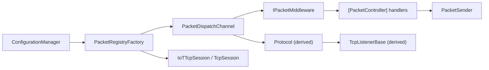

# 🧠 Architecture

Nalix keeps configuration, catalogs, dispatch, and transport in separate layers so server and client stay deterministic.

### 🧭 High-level layout
Each layer has a single job; the same catalog and metadata flow through both server and client paths.

!!! tip "Flow"
    Config → Catalog → Dispatch → Middleware/Handlers → Transport (Listener or Client)



### ⚙️ Runtime services
Configuration and shared singletons are loaded once and reused everywhere.

**Responsibilities**
- Read `default.ini` and validate options.
- Register shared services (`ILogger`, `IPacketRegistry`).

**Key Components**
- `ConfigurationManager`
- `InstanceManager`
- `TransportOptions`
- `NetworkSocketOptions`

```csharp
InstanceManager.Instance.Register<ILogger>(NLogix.Host.Instance);
TransportOptions options = ConfigurationManager.Instance.Get<TransportOptions>();
options.Validate();
```

### 🧩 Catalog & metadata
Metadata providers feed into the packet catalog that both server and client share.

**Responsibilities**
- Register metadata providers.
- Build and register the catalog once.

**Key Components**
- `PacketMetadataProviders`
- `PacketCustomAttributeProvider`
- `PacketRegistryFactory`
- `PacketRegistry`

```csharp
PacketMetadataProviders.Register(new PacketCustomAttributeProvider());
IPacketRegistry registry = new PacketRegistryFactory().CreateCatalog();
InstanceManager.Instance.Register(registry);
```

### 🔁 Dispatch pipeline
Dispatch compiles handlers once and runs middleware in order.

**Responsibilities**
- Attach middleware.
- Register handler controllers.

**Key Components**
- `PacketDispatchChannel`
- `PacketDispatchOptions`
- `PacketContext<TPacket>`

```csharp
PacketDispatchChannel channel = new(options =>
{
    options.WithMiddleware(new TimeoutMiddleware());
    options.WithHandler(() => new HandshakeHandlers());
});
```

### 🚦 Transport
Server and client share the catalog but use different transports.

**Responsibilities**
- Server: accept sockets, route frames to dispatch.
- Client: open sessions, send handshake, reuse catalog.

**Key Components**
- `Protocol` (derived)
- `TcpListenerBase` (derived)
- `IoTTcpSession` / `TcpSession`
- `Handshake`

```csharp
sealed class DemoProtocol : Protocol
{
    private readonly PacketDispatchChannel _dispatch;
    public DemoProtocol(PacketDispatchChannel dispatch) => _dispatch = dispatch;
    public override void ProcessMessage(object sender, IConnectEventArgs args)
        => _dispatch.HandlePacket(args.Lease, args.Connection);
}

sealed class DemoListener : TcpListenerBase
{
    public DemoListener(ushort port, IProtocol protocol) : base(port, protocol) { }
}

IoTTcpSession client = new();
await client.ConnectAsync("127.0.0.1", 57206);
Handshake hs = new(0, Csprng.GetBytes(32));
await client.SendAsync(hs.Serialize());
```
