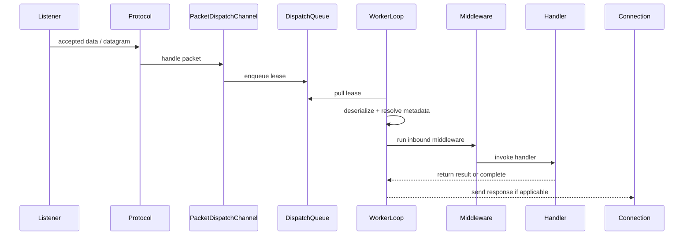

# Architecture

This page describes the current server-side shape of `Nalix.Network` as it exists in `src`, without the older placeholder layers and renamed runtime pieces.

Use this page when you want the big picture before diving into API pages.

## Runtime map

At a high level, a Nalix server is built from:

- listeners that accept TCP or UDP traffic
- a protocol that decides how accepted traffic is processed
- a dispatch channel that deserializes packets and invokes handlers
- connection services that keep session state and transport helpers alive
- throttling and middleware that protect the runtime under load

```mermaid
flowchart LR
    Client["Client"] --> Listener["TcpListenerBase / UdpListenerBase"]
    Listener --> Protocol["Protocol"]
    Protocol --> Dispatch["PacketDispatchChannel queue + worker loop"]
    Dispatch --> Deserialize["Packet registry deserialize"]
    Deserialize --> Metadata["Resolve handler + metadata"]
    Metadata --> Middleware["Packet middleware"]
    Middleware --> Handler["Handler controller / method"]
    Handler --> Connection["Connection / ConnectionHub"]
```

## Main server flow

The common TCP path looks like this:

1. `TcpListenerBase` accepts a socket.
2. `ConnectionLimiter` may reject or ban the endpoint before full admission.
3. The listener creates a `Connection` and passes it to `Protocol.OnAccept(...)`.
4. The protocol receives framed data and forwards work into `PacketDispatchChannel`.
5. Dispatch queues the work, the worker loop deserializes the packet, resolves metadata, runs middleware, invokes the handler, and optionally sends a result back through the connection.

The UDP path follows the same broad model, but datagrams are authenticated and mapped to session state differently inside `UdpListenerBase`.

## Core building blocks

### Listeners

- `TcpListenerBase` owns accept loops, backpressure, timing-wheel integration, and connection lifecycle.
- `UdpListenerBase` owns datagram receive loops, auth validation, and UDP session handling.

### Protocol

`Protocol` is the bridge between transport and dispatch. It is where accepted connections are initialized and where incoming message buffers are handed over to application dispatch.

### Dispatch

`PacketDispatchChannel` is the application entry point for packets. It is responsible for:

- queueing inbound work
- running the worker loop
- deserializing packets with the packet registry
- resolving handler descriptors and metadata
- running middleware
- processing handler return values

Under the hood it uses `PacketDispatchOptions<TPacket>` and shard-aware worker loops.

### Connection state

`Connection` and `ConnectionHub` provide:

- live connection lookup
- session/user correlation
- send helpers for TCP and UDP
- diagnostics and cleanup hooks

### Protection and pressure control

The network runtime is designed to run with pressure controls enabled, not as an afterthought.

Typical pieces are:

- `ConnectionLimiter` for admission control
- `TokenBucketLimiter` and `PolicyRateLimiter` for request-rate protection
- `ConcurrencyGate` for in-flight handler limits
- `TimingWheel` for timeout and scheduled expiry handling
- `TimeSynchronizer` for periodic time-sync events used by the listener layer

## Dispatch pipeline

Conceptually, packet dispatch looks like this:

The exact middleware stack depends on your configuration and metadata. Packet attributes such as permission, timeout, concurrency, and rate limits become runtime behavior through the metadata pipeline.

## Where other packages fit

- `Nalix.Common` provides contracts and packet attributes.
- `Nalix.Framework` provides `ConfigurationManager`, `InstanceManager`, `TaskManager`, `Snowflake`, and timing helpers.
- `Nalix.Framework` provides built-in packet types, packet registry support, and shared runtime helpers.
- `Nalix.SDK` is the client-side counterpart.

## Recommended next pages

- [Real-time Engine](./real-time.md)
- [Middleware](./middleware.md)
- [Packet Dispatch](../api/routing/packet-dispatch.md)
- [Connection Hub](../api/network/connection/connection-hub.md)
- [Server Blueprint](../guides/server-blueprint.md)
