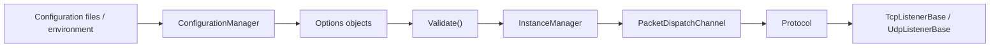

# Configuration and Runtime

This page explains how configuration becomes a running Nalix server.

Use it when you understand the network pieces individually, but want a clearer picture of how startup wiring is supposed to fit together.

## The short version

Nalix startup usually follows this shape:

1. load configuration
2. materialize options
3. validate options
4. register shared services
5. build dispatch
6. build protocol and listener
7. activate the runtime

That order matters because most network components assume validated options and shared services already exist.

## ConfigurationManager

`ConfigurationManager` is the central entry point for configuration values and option binding.

In practice it is used to:

- load config sources
- bind option classes
- retrieve typed runtime settings

The important habit is to resolve and validate your major options early, not lazily after traffic starts.

## Options classes

Nalix uses focused option types instead of one large server settings object.

Common examples in the network layer:

- `NetworkSocketOptions`
- `DispatchOptions`
- `ConnectionLimitOptions`
- `ConnectionHubOptions`
- `TimingWheelOptions`
- `PoolingOptions`

This keeps each runtime concern configurable without mixing unrelated settings together.

## Validate at startup

Most production issues are cheaper to catch before listeners open.

A good startup path resolves and validates:

- socket options
- dispatch options
- connection limits
- connection hub behavior
- timing and pooling settings

That gives you one failure point during startup instead of hidden runtime misconfiguration.

## InstanceManager

`InstanceManager` is the runtime registry for shared services and common singleton-style wiring.

Use it for things like:

- logger instances
- packet registry
- shared helpers used across handlers and runtime components

The point is not abstract DI theory. The point is giving the runtime and your handlers one consistent place to resolve shared infrastructure.

## Dispatch is where the app becomes real

After configuration and shared services are ready, `PacketDispatchChannel` becomes the main application entry point.

This is where you usually attach:

- packet middleware
- buffer middleware
- logging hooks
- error handling hooks
- handler factories

Once dispatch is activated, the server has a working application pipeline.

## Protocol and listener are the transport shell

After dispatch exists:

- `Protocol` bridges transport to dispatch
- the listener owns socket acceptance and receive loops

You can think of it like this:

- configuration defines the runtime
- dispatch defines the application path
- protocol and listeners expose that path to the network

## A safe startup pattern

For most teams, this is the safest default:

1. bind and validate options
2. register logger and packet registry
3. register metadata providers if needed
4. build dispatch
5. build protocol
6. build listener
7. activate dispatch, then start listening

That keeps startup deterministic and easier to debug.

## Read this next

- [Server Blueprint](../guides/server-blueprint.md)
- [Production Checklist](../guides/production-checklist.md)
- [Configuration & DI](../api/framework/runtime/configuration.md)
- [Network Options](../api/network/options/options.md)
