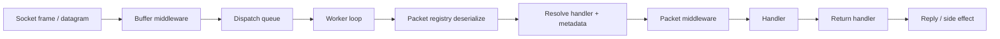

# Packet Lifecycle

This page explains what happens to a request after bytes arrive at the server.

Use it when you want one clear mental model for how transport, dispatch, metadata, middleware, and handlers connect.

## The request path

## Step 1. Traffic enters through a listener

The runtime starts with a listener:

- `TcpListenerBase` for reliable ordered traffic
- `UdpListenerBase` for authenticated low-latency datagrams

The listener accepts traffic and forwards it into the active protocol.

## Step 2. Protocol forwards data into dispatch

`Protocol` is the bridge between transport and application dispatch.

Its job is to:

- accept or reject live connections
- receive framed traffic
- forward inbound data into `PacketDispatchChannel`

At this point, the runtime still has bytes, not a packet object.

## Step 3. Buffer middleware gets the first chance to act

Before deserialization, buffer middleware can inspect raw `IBufferLease` data.

Use this layer for:

- decryption
- decompression
- frame validation
- early rejection of malformed traffic

If a frame should not continue, this is the cheapest place to stop it.

## Step 4. Dispatch deserializes the packet

Once the frame is ready, `PacketDispatchChannel` first queues the work, then its worker loop uses the packet registry to deserialize it into an `IPacket`.

This is the transition from transport-level work to application-level work.

After this point, middleware and handlers can reason about:

- packet type
- opcode
- connection state
- handler metadata

## Step 5. Handler metadata is resolved

Before packet middleware runs, the runtime resolves the metadata attached to the matched handler.

That metadata usually comes from:

- packet attributes on the handler method
- custom `IPacketMetadataProvider` implementations

Examples:

- `PacketOpcode`
- `PacketPermission`
- `PacketTimeout`
- `PacketRateLimit`
- custom tenant or feature attributes

## Step 6. Packet middleware applies policy

Packet middleware runs with a full `PacketContext<TPacket>`.

This is where application-aware checks happen:

- permission checks
- timeout handling
- rate limiting
- concurrency limits
- audit and policy decisions

By this stage, the runtime knows both the packet and the handler metadata.

## Step 7. The handler runs

If middleware allows the request through, the handler executes.

Handlers can:

- return a packet
- return a supported async result
- send manually through the connection
- perform side effects without replying

## Step 8. The return handler decides what to send

Nalix supports multiple handler return shapes.

The internal return handler converts them into outbound behavior, for example:

- send a reply packet
- send text or bytes
- skip outbound work
- complete with no response

This is why the handler does not need to manually build every reply path.

## The practical takeaway

The request path is easiest to reason about in three phases:

1. transport phase: listener, protocol, raw frame handling
2. dispatch phase: queueing, worker loop, deserialization, metadata, middleware
3. application phase: handler, return handling, reply

If you know which phase your problem belongs to, you usually know which Nalix component to customize.

## Read this next

- [Architecture](./architecture.md)
- [Middleware](./middleware.md)
- [Packet Dispatch](../api/routing/packet-dispatch.md)
- [Packet Metadata](../api/routing/packet-metadata.md)
- [TCP Request/Response](../guides/tcp-request-response.md)
