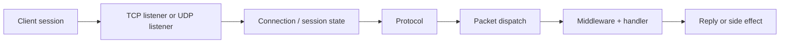

# Real-time Engine

Nalix is designed around a simple real-time server model:

- long-lived sessions
- predictable dispatch flow
- explicit throttling and timeout controls
- TCP for reliable request/response
- UDP for low-latency datagrams when needed

Use this page when you want to understand the runtime mindset behind the network layer, not just individual types.

## Mental model

## 1. Session lifecycle

At runtime, Nalix keeps state around the connection, not just around one message.

That state includes:

- connection ID
- remote endpoint
- permission level
- secret / algorithm
- bytes sent, uptime, ping time, and error count

This is why `Connection` and `ConnectionHub` are core parts of the real-time model.

## 2. Request flow

A normal TCP request looks like:

1. socket accepted
2. `Protocol.OnAccept(...)` starts receive
3. protocol forwards frames into `PacketDispatchChannel`
4. dispatch deserializes, runs middleware, and invokes handler
5. handler returns or sends a response

For client work, the easiest mindset is:

- TCP = reliable command/request flow
- dispatch = application entry point
- middleware = policy layer

## 3. Low-latency datagrams

Nalix also supports a UDP runtime through `UdpListenerBase`.

Typical use cases:

- game state updates
- telemetry
- discovery
- fast non-critical real-time signals

The UDP path still depends on session identity and authentication rules, instead of being a totally separate world.

## 4. Throttling and protection

Real-time systems fail fastest when they do not control pressure.

Nalix bakes that into the model with:

- `ConnectionLimiter`
- `TokenBucketLimiter`
- `PolicyRateLimiter`
- `ConcurrencyGate`
- timeout enforcement through `TimingWheel`

These are not optional “extras”. They are part of making the engine stable under real traffic.

## 5. Why packet metadata matters

Attributes on handlers become runtime behavior.

Examples:

- `[PacketPermission]`
- `[PacketTimeout]`
- `[PacketRateLimit]`
- `[PacketConcurrencyLimit]`

That metadata is resolved once, then reused through dispatch and middleware. This keeps the real-time path fast and consistent.

## Read this next

- [Architecture](./architecture.md)
- [Middleware](./middleware.md)
- [Packet Dispatch](../api/routing/packet-dispatch.md)
- [TCP Request/Response](../guides/tcp-request-response.md)
- [UDP Auth Flow](../guides/udp-auth-flow.md)
