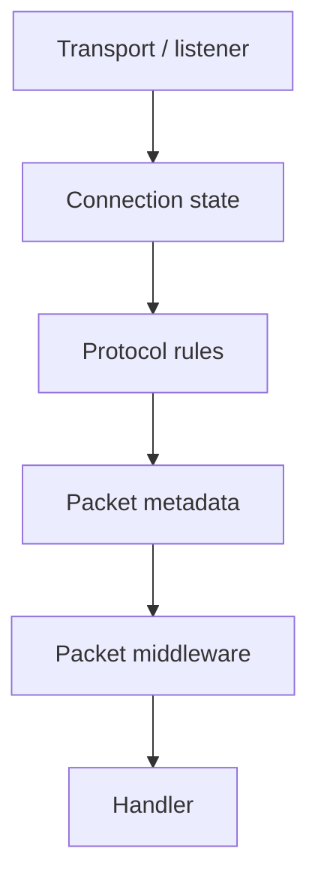

# Security Model

This page explains where security decisions happen in Nalix.

Use it when you want the mental model for permissions, packet metadata, handshake-related setup, and UDP authentication without reading every API page first.

## Security in Nalix is layered

Nalix does not treat security as one isolated feature.

It is spread across several layers:

- transport setup
- connection state
- packet metadata
- middleware
- protocol-specific authentication rules

That is a good thing. It means you can place checks at the cheapest or most appropriate point in the request path.

## The layers

## Connection state carries security context

`Connection` holds the live session information that many security decisions rely on.

That can include:

- permission level
- session identity
- remote endpoint
- secret or cipher state
- authentication-related runtime flags

This is why permission checks and transport/auth flow are tightly connected in Nalix.

## Packet metadata turns attributes into rules

Many security-related behaviors start as handler attributes.

Examples:

- `[PacketPermission]`
- `[PacketEncryption]`
- `[PacketTimeout]`
- `[PacketRateLimit]`

Dispatch resolves those attributes into `PacketMetadata`, and packet middleware reads the result through `PacketContext.Attributes`.

That keeps security rules close to the handlers they protect.

## Middleware is the enforcement layer

Packet middleware is where most request-level enforcement should live.

Typical examples:

- deny packets below the required permission level
- enforce per-handler timeout and concurrency rules
- apply rate limits
- audit suspicious traffic

Buffer middleware can enforce earlier transport-level rules when raw-frame inspection is required.

## Handshake and cryptography setup

Cryptography is not the whole security model, but it is part of it.

Depending on your protocol and client flow, startup and session establishment may involve:

- key agreement
- envelope or AEAD encryption
- credential derivation
- secret assignment on the live connection

Those pieces prepare the connection for secure traffic, but packet metadata and middleware still control request-level policy later.

## UDP has its own rules

UDP should be treated as an authenticated datagram path, not as a looser copy of TCP.

In practice that means:

- session identity must already exist
- datagrams must be authenticated
- replay and timestamp checks matter
- endpoint mapping and session state matter

That is why `UdpListenerBase` and the UDP auth flow deserve their own guide. The transport is different enough that the security model needs to be explicit.

## A safe mental model

For most teams, the easiest way to reason about security is:

1. establish a trusted session
2. keep identity and permission state on the connection
3. declare packet-level rules with attributes
4. enforce those rules in middleware
5. treat UDP as an authenticated extension, not a shortcut

## Read this next

- [UDP Auth Flow](../guides/udp-auth-flow.md)
- [Custom Middleware End-to-End](../guides/custom-middleware-end-to-end.md)
- [Packet Metadata](../api/routing/packet-metadata.md)
- [Packet Attributes](../api/routing/packet-attributes.md)
- [Cryptography Overview](../api/security/cryptography.md)
