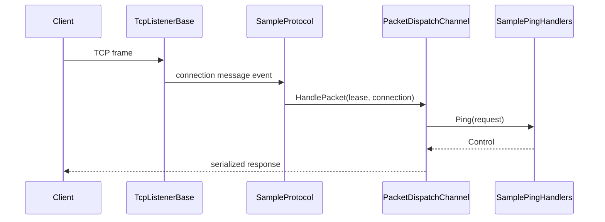

# End-to-End Sample

This guide shows the smallest useful Nalix TCP server flow:

1. register shared services
2. build a packet dispatcher
3. forward frames from `Protocol` into dispatch
4. start a `TcpListenerBase`
5. send one request and receive one response

The sample is intentionally small so clients can copy the structure first and optimize later.

Use it when you want the shortest path from a listener to a handler reply.

## Server

### 1. Register shared services

```csharp
InstanceManager.Instance.Register<ILogger>(logger);
InstanceManager.Instance.Register<IPacketRegistry>(packetRegistry);
```

### 2. Create handlers

```csharp
[PacketController("SamplePingHandlers")]
public sealed class SamplePingHandlers
{
    [PacketOpcode(0x1001)]
    public ValueTask<Control> Ping(PacketContext<IPacket> request)
    {
        Control packet = (Control)request.Packet;
        packet.Type = ControlType.PONG;
        return ValueTask.FromResult(packet);
    }
}
```

### 3. Build the dispatcher

```csharp
PacketDispatchChannel dispatch = new(options =>
{
    options.WithLogging(logger)
           .WithHandler(() => new SamplePingHandlers());
});

dispatch.Activate();
```

### 4. Bridge protocol to dispatch

```csharp
public sealed class SampleProtocol : Protocol
{
    private readonly PacketDispatchChannel _dispatch;

    public SampleProtocol(PacketDispatchChannel dispatch) => _dispatch = dispatch;

    public override void ProcessMessage(object sender, IConnectEventArgs args)
        => _dispatch.HandlePacket(args.Lease, args.Connection);
}
```

### 5. Start the listener

```csharp
public sealed class SampleTcpListener : TcpListenerBase
{
    public SampleTcpListener(ushort port, IProtocol protocol) : base(port, protocol) { }
}

SampleTcpListener listener = new(57206, new SampleProtocol(dispatch));
listener.Activate();
```

## Client

The transport/session abstraction can vary on your side, but the request/response pattern is:

```csharp
Control request = new() { Type = ControlType.PING };

await client.SendAsync(request.Serialize());
Control response = await WaitForControlAsync();

Console.WriteLine(response.Type); // PONG
```

## Full flow



## What to customize next

- add middleware
- add packet attributes such as timeout, permission, or rate limit
- switch some handlers to `PacketContext<TPacket>` when you need explicit manual sending

## Related pages

- [TCP Request/Response](./tcp-request-response.md)
- [Custom Middleware](./custom-middleware-end-to-end.md)
- [Packet Dispatch](../api/routing/packet-dispatch.md)
