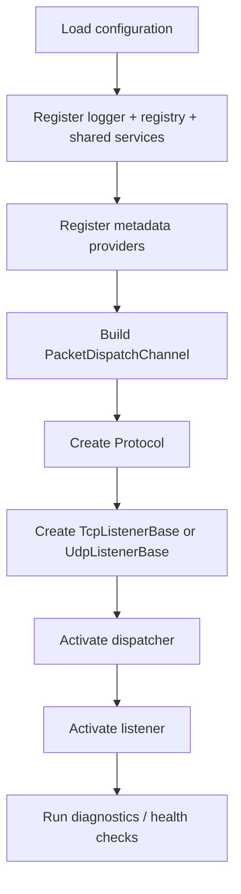

# Server Blueprint

This page is the recommended blueprint for a real Nalix server project.

It is not the smallest sample. It is the shape that scales best when a client team starts adding real handlers, middleware, options, and operational checks.

Use it when the starter template is too small and you need a cleaner production-oriented startup shape.

## Recommended project flow

Build your server startup in this order:

1. load and validate configuration
2. register shared services
3. register metadata providers
4. build the packet dispatch channel
5. create protocol
6. create listener
7. activate dispatch, then listener
8. expose diagnostics/report endpoints if needed

## Blueprint diagram



## 1. Configuration layer

Load and validate the network options that matter before starting any runtime.

```csharp
NetworkSocketOptions socket = ConfigurationManager.Instance.Get<NetworkSocketOptions>();
socket.Validate();

PoolingOptions pooling = ConfigurationManager.Instance.Get<PoolingOptions>();
pooling.Validate();

DispatchOptions dispatchOptions = ConfigurationManager.Instance.Get<DispatchOptions>();
dispatchOptions.Validate();

ConnectionLimitOptions connectionLimits =
    ConfigurationManager.Instance.Get<ConnectionLimitOptions>();
connectionLimits.Validate();
```

If you use the connection hub heavily, validate that too:

```csharp
ConnectionHubOptions hubOptions = ConfigurationManager.Instance.Get<ConnectionHubOptions>();
hubOptions.Validate();
```

## 2. Shared services

At minimum, register:

- `ILogger`
- `IPacketRegistry`

```csharp
InstanceManager.Instance.Register<ILogger>(logger);
InstanceManager.Instance.Register<IPacketRegistry>(packetRegistry);
```

If your handlers use app services, register them here as well.

## 3. Metadata providers

If you use custom metadata conventions, register providers before compiling handlers:

```csharp
PacketMetadataProviders.Register(new SampleTenantMetadataProvider());
PacketMetadataProviders.Register(new SampleAuditMetadataProvider());
```

## 4. Dispatch layer

This is the center of application-level behavior.

```csharp
PacketDispatchChannel dispatch = new(options =>
{
    options.WithLogging(logger)
           .WithErrorHandling((ex, opcode) =>
           {
               logger.Error($"dispatch-error opcode=0x{opcode:X4}", ex);
           })
           .WithErrorHandlingMiddleware(
               continueOnError: false,
               errorHandler: (ex, type) => logger.Error($"middleware-error type={type.Name}", ex))
           .WithMiddleware(new SampleAuditMiddleware<IPacket>())
           .WithHandler(() => new SampleAccountHandlers())
           .WithHandler(() => new SampleMatchHandlers())
           .WithHandler(() => new SampleAdminHandlers());
});
```

### Good blueprint rule

Keep dispatch setup in one place.

Do not spread `WithMiddleware(...)` and `WithHandler(...)` across random files. That makes startup order hard to reason about.

## 5. Protocol layer

Your protocol should usually stay thin.

Its job is to bridge incoming frames into dispatch, not to become the business layer.

```csharp
public sealed class ServerProtocol : Protocol
{
    private readonly PacketDispatchChannel _dispatch;

    public ServerProtocol(PacketDispatchChannel dispatch)
    {
        _dispatch = dispatch;
        this.SetConnectionAcceptance(true);
    }

    public override void ProcessMessage(object sender, IConnectEventArgs args)
        => _dispatch.HandlePacket(args.Lease, args.Connection);

    protected override bool ValidateConnection(IConnection connection)
    {
        // Optional connection admission checks
        return true;
    }
}
```

## 6. Listener layer

Create the listener after dispatch and protocol exist.

```csharp
public sealed class ServerListener : TcpListenerBase
{
    public ServerListener(ushort port, IProtocol protocol) : base(port, protocol) { }
}

ServerProtocol protocol = new(dispatch);
ServerListener listener = new(socket.Port, protocol);
```

## 7. Activation order

Recommended order:

```csharp
dispatch.Activate();
listener.Activate();
```

Recommended shutdown order:

```csharp
listener.Deactivate();
dispatch.Dispose();
listener.Dispose();
```

## 8. Diagnostics surface

A strong server blueprint also includes a place to pull reports from:

- `listener.GenerateReport()`
- `protocol.GenerateReport()`
- `connectionHub.GenerateReport()`
- `dispatch.GenerateReport()`
- limiter / gate reports when you use them

Even if you do not expose an admin API on day one, keep a way to print these quickly.

## Suggested folder layout

One good starting layout:

```text
Server/
  Bootstrap/
    ServiceRegistration.cs
    DispatchRegistration.cs
    ListenerRegistration.cs
  Protocols/
    ServerProtocol.cs
  Handlers/
    SampleAccountHandlers.cs
    SampleMatchHandlers.cs
    SampleAdminHandlers.cs
  Middleware/
    SampleAuditMiddleware.cs
    SampleTenantGuardMiddleware.cs
  Metadata/
    SampleTenantMetadataProvider.cs
    SampleAuditMetadataProvider.cs
  Hosting/
    ServerHost.cs
```

## Strong defaults

If you do not know what to optimize yet:

- keep `Protocol` thin
- keep middleware small and explicit
- use return values for simple replies
- use `PacketContext<TPacket>` only when you need manual send control
- keep all startup wiring centralized

## Read this next

- [Production Checklist](./production-checklist.md)
- [Custom Middleware](./custom-middleware-end-to-end.md)
- [Custom Metadata Provider](./custom-metadata-provider.md)
- [TCP Request/Response](./tcp-request-response.md)
