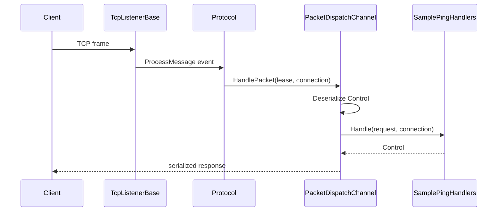

# TCP Request/Response Example

This example shows a complete TCP request/response flow using:

- `TcpListenerBase`
- `Protocol`
- `PacketDispatchChannel`
- a request packet
- a response returned from a handler

The goal is clarity, not production completeness.

Use it when you want one canonical TCP sample before adding middleware, metadata, or more complex client behavior.

## Scenario

Client sends a `Control` packet.

Server replies with a `Control` packet.

## Server setup

### 1. Register shared services

```csharp
InstanceManager.Instance.Register<ILogger>(logger);
InstanceManager.Instance.Register<IPacketRegistry>(packetRegistry);
```

### 2. Create handler

```csharp
[PacketController("SamplePingHandlers")]
public sealed class SamplePingHandlers
{
    [PacketOpcode(0x1001)]
    public ValueTask<Control> Handle(Control request, IConnection connection)
    {
        request.Type = ControlType.PONG;
        return ValueTask.FromResult(request);
    }
}
```

### 3. Create dispatcher

```csharp
PacketDispatchChannel dispatch = new(options =>
{
    options.WithLogging(logger)
           .WithHandler(() => new SamplePingHandlers());
});

dispatch.Activate();
```

### 4. Create protocol

```csharp
public sealed class SampleProtocol : Protocol
{
    private readonly PacketDispatchChannel _dispatch;

    public SampleProtocol(PacketDispatchChannel dispatch) => _dispatch = dispatch;

    public override void ProcessMessage(object sender, IConnectEventArgs args)
        => _dispatch.HandlePacket(args.Lease, args.Connection);
}
```

### 5. Start listener

```csharp
public sealed class SampleTcpListener : TcpListenerBase
{
    public SampleTcpListener(ushort port, IProtocol protocol) : base(port, protocol) { }
}

SampleTcpListener listener = new(57206, new SampleProtocol(dispatch));
listener.Activate();
```

## Client flow

The exact client implementation depends on your SDK/session abstraction, but the request/response shape is:

```csharp
Control request = new() { Type = ControlType.PING };

await client.SendAsync(request.Serialize());

// Your client-side read loop / awaiter resolves Control here
Control response = await WaitForControlAsync();
Console.WriteLine(response.Type);
```

## End-to-end flow



## Variant: send manually from handler

Instead of returning a response, you can send manually:

```csharp
[PacketOpcode(0x1001)]
public async ValueTask Handle(PacketContext<Control> context, CancellationToken ct)
{
    await context.Sender.SendAsync(new Control { Type = ControlType.PONG }, ct);
}
```

Use this style when:

- you want multiple replies
- you need finer control over send timing
- you do not want to rely on return-type handling

## What clients should remember

- returning `Control` is the simplest normal request/response model
- `Protocol` just forwards frames into dispatch
- `PacketDispatchChannel` owns middleware, deserialization, handler invocation, and result handling

## Related pages

- [Packet Dispatch](../api/routing/packet-dispatch.md)
- [Handler Return Types](../api/routing/handler-results.md)
- [TCP Listener](../api/network/runtime/tcp-listener.md)
