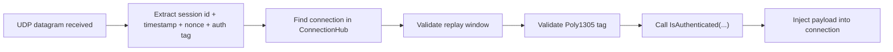

# UDP Auth Flow Example

This guide explains the actual UDP authentication shape used by `UdpListenerBase` today, in a client-friendly way.

Use it when you already know you need UDP and want to understand the trust and replay rules before implementing a client.

## What the runtime expects

When `UdpListenerBase` receives a datagram, it expects the payload to end with authentication metadata:

- connection/session identifier
- timestamp
- nonce
- authentication tag

In source, the listener validates:

- session exists in `ConnectionHub`
- replay window is still valid
- Poly1305 tag matches payload + metadata + remote endpoint
- your overridden `IsAuthenticated(...)` also returns `true`

## High-level flow



## Server shape

### 1. Subclass `UdpListenerBase`

```csharp
public sealed class SampleUdpListener : UdpListenerBase
{
    public SampleUdpListener(IProtocol protocol) : base(protocol) { }

    protected override bool IsAuthenticated(IConnection connection, in UdpReceiveResult result)
    {
        // Add your own checks here:
        // - allowed endpoint
        // - session state
        // - region / shard ownership
        return connection.Secret is not null && connection.Secret.Length > 0;
    }
}
```

### 2. Keep TCP and UDP tied to the same session

The UDP path assumes there is already a known connection in `ConnectionHub`.

That means a common pattern is:

1. authenticate or handshake on TCP first
2. create/populate the connection secret
3. store the session in `ConnectionHub`
4. allow UDP packets to reference that session ID

## Conceptual client packet layout

The listener currently validates these parts:

```text
[payload][session-id][timestamp][nonce][poly1305-tag]
```

The authentication tag is computed from:

- payload
- session ID bytes
- timestamp bytes
- nonce bytes
- encoded remote endpoint
- the connection secret

## Pseudocode for client-side send

```csharp
byte[] payload = BuildGamePayload();
byte[] sessionId = connectionId.ToBytes();
long timestamp = CurrentUnixMilliseconds();
ulong nonce = NextNonce();

byte[] tag = ComputePoly1305(
    secret: sessionSecret,
    payload: payload,
    sessionId: sessionId,
    timestamp: timestamp,
    nonce: nonce,
    remoteEndPoint: serverEndPoint);

byte[] datagram = Concat(payload, sessionId, BitConverter.GetBytes(timestamp), BitConverter.GetBytes(nonce), tag);
await udp.SendAsync(datagram, serverEndPoint);
```

## Replay protection

The runtime rejects datagrams that fall outside the replay window.

Today the code uses a window of about 30 seconds, so clients should:

- keep clocks reasonably aligned
- generate timestamps at send time
- generate a fresh nonce per datagram
- avoid replaying stale datagrams

## What happens on failure

The listener records diagnostics for:

- short packets
- unknown sessions
- unauthenticated packets
- receive errors

Invalid packets are dropped before they reach your protocol logic.

## Recommended rollout

For a simple deployment:

1. establish session over TCP
2. assign/store session secret
3. return session ID to the client
4. let the client send authenticated UDP datagrams
5. verify in `IsAuthenticated(...)` that the session is ready for UDP

## Related pages

- [UDP Listener](../api/network/runtime/udp-listener.md)
- [UDP Session](../api/sdk/udp-session.md)
- [Connection Hub](../api/network/connection/connection-hub.md)
- [Network Options](../api/network/options/options.md)
