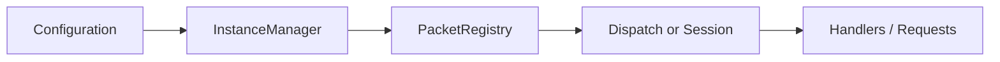

# Nalix

Nalix is a .NET networking stack for building TCP and UDP systems with a shared packet model across server and client code.

The docs are organized around the parts people actually use:

- `Nalix.Network` for listeners, connections, dispatch, middleware, and server-side limits
- `Nalix.SDK` for client TCP sessions, request helpers, handshakes, and directives
- `Nalix.Framework` for configuration, service registration, and background workers
- `Nalix.Common` and `Nalix.Framework` for contracts, packet attributes, built-in frames, and shared runtime helpers

## Start here

If you are new to the project, read in this order:

1. [Introduction](./introduction.md)
2. [Installation](./installation.md)
3. [Quick Start](./quickstart.md)
4. [Packages Overview](./packages/index.md)

If you are building a server, continue with:

- [Nalix.Network](./packages/nalix-network.md)
- [Architecture](./concepts/architecture.md)
- [Server Blueprint](./guides/server-blueprint.md)

If you are building a client, continue with:

- [Nalix.SDK](./packages/nalix-sdk.md)
- [SDK Overview](./api/sdk/index.md)
- [TCP Session](./api/sdk/tcp-session.md)

## Core runtime idea

The normal Nalix flow is:

1. load typed configuration
2. register shared services such as `ILogger` and `IPacketRegistry`
3. build packet dispatch
4. start a listener or connect a client session
5. exchange packets through the same registry and metadata rules

## Minimal example

## What this site tries to answer

- which package to install
- how to start a server
- how to start a client
- how dispatch, middleware, and metadata fit together
- which runtime options matter in production
