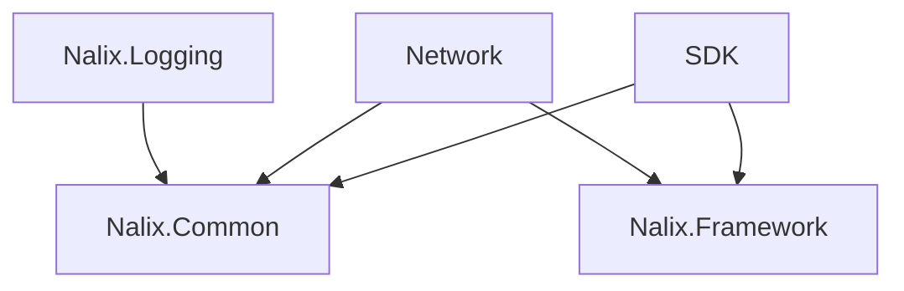

# Packages Overview

Use these packages together or separately depending on whether you are building the server, the client, or shared contracts.

!!! info "Version note"
    Latest verified public package version on 2026-03-27:

    - `Nalix.Network`: `12.0.0`
    - `Nalix.SDK`: `12.0.0`

!!! tip "Safe default package choice"
    If you are building a server, start with `Nalix.Network`, `Nalix.Common`, and `Nalix.Framework`.
    If you are building a client, start with `Nalix.SDK`, `Nalix.Common`, and `Nalix.Framework`.

| Package | Use it for | Key types |
| --- | --- | --- |
| Nalix.SDK | Client TCP sessions, request helpers, and control/directive flows; `UdpSession` exists but is currently unsupported | `TcpSession`, `IoTTcpSession`, `UdpSession`, `TransportOptions`, `RequestOptions` |
| Nalix.Network | Listeners, connections, dispatch pipeline, server-side throttling | `TcpListenerBase`, `UdpListenerBase`, `ConnectionHub`, `PacketDispatchChannel` |
| Nalix.Common | Shared contracts, packet attributes, middleware contracts | `IPacket`, `IConnection`, `PacketControllerAttribute`, `PacketOpcodeAttribute` |
| Nalix.Logging | Structured logging and targets | `NLogix`, `NLogixOptions`, `ILoggerTarget` |
| Nalix.Framework | Configuration, service registry, scheduling, IDs, timing helpers, built-in frames, registry, serializer helpers | `ConfigurationManager`, `InstanceManager`, `TaskManager`, `Snowflake`, `Clock`, `PacketRegistryFactory`, `PacketRegistry`, `Handshake`, `Control`, `Text256/512/1024` |

## Minimal wiring map

- Client-only: `Nalix.SDK` + `Nalix.Common` and optionally `Nalix.Framework` if you want `ConfigurationManager` / `InstanceManager`.
- Server-only: `Nalix.Network` + `Nalix.Common` + `Nalix.Framework`.
- Full stack: all packages, with one shared packet catalog shape on both sides.

## Quick example

