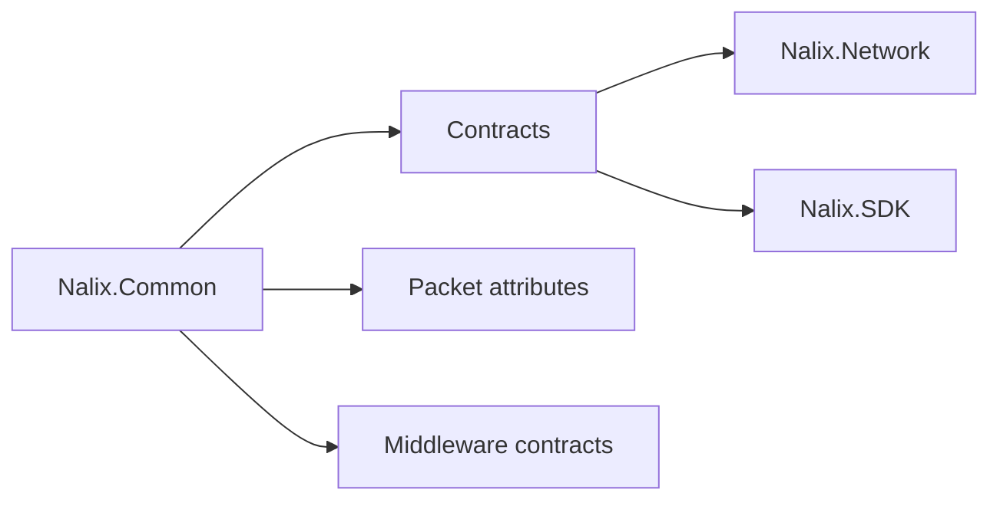

# Nalix.Common

Shared contracts, packet metadata, and middleware primitives used across SDK and server code.

## Where it fits



### Core contracts
These contracts keep SDK and server code aligned.

**Key Components**
- `IPacket`
- `IConnection`
- `PacketControllerAttribute`
- `PacketOpcodeAttribute`

### Quick example

```csharp
[PacketController("SamplePingHandlers")]
public class SamplePingHandlers
{
    [PacketOpcode(1)]
    public IPacket HandlePing(PacketContext<IPacket> request)
        => request.Packet;
}
```

Legacy handlers that take `(TPacket, IConnection[, CancellationToken])` are still supported, but `PacketContext<TPacket>` is the preferred shape when you need context, sender, or metadata access.

### Metadata and attributes
Metadata is built once during handler registration and later exposed through `PacketContext`.

**Key Components**
- `PacketMetadataBuilder`
- `PacketContext<TPacket>`

### Quick example

```csharp
PacketMetadataProviders.Register(new SampleTenantMetadataProvider());
```

### Middleware primitives
Middleware runs over packet contexts and can short-circuit outbound flows.

**Key Components**
- `IPacketMiddleware<TPacket>`
- `PacketContext<TPacket>`
- `PacketSender<TPacket>`

### Quick example

```csharp
public sealed class SamplePacketMiddleware : IPacketMiddleware<IPacket>
{
    public async Task InvokeAsync(
        PacketContext<IPacket> context,
        Func<CancellationToken, Task> next)
    {
        await next(context.CancellationToken);
    }
}
```

### Shared enums
Enums keep policies consistent across the stack.

**Key Components**
- `CipherSuiteType`
- `DropPolicy`

## Key API pages

- [Packet Contracts](../api/common/packet-contracts.md)
- [Connection Contracts](../api/common/connection-contracts.md)
- [Packet Attributes](../api/routing/packet-attributes.md)
- [Packet Metadata](../api/routing/packet-metadata.md)
- [Concurrency Contracts](../api/common/concurrency-contracts.md)
