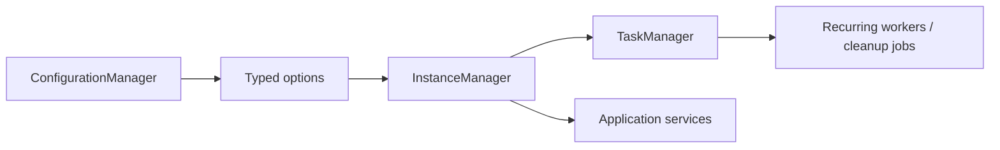
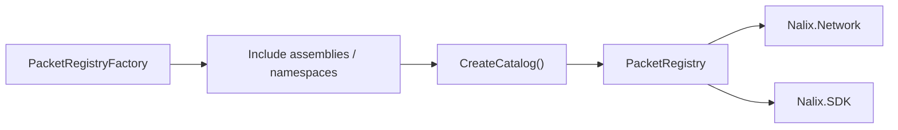

# Nalix.Framework

`Nalix.Framework` provides shared runtime services for configuration, instance registration, scheduling, IDs, frames, packet registry, and serialization helpers used by both SDK and Network.

!!! note "This package is infrastructure, not business logic"
    Use it to centralize configuration, shared services, workers, and timing primitives that other packages rely on.

## Runtime services map



## What belongs here

- `ConfigurationManager` for loading and reloading typed options from INI files
- `InstanceManager` for registering or creating shared singleton-like services
- `TaskManager` for background workers and recurring jobs
- `Snowflake` for generated IDs
- `Clock` and `TimingScope` for monotonic timing and lightweight latency measurement

## Configuration

`ConfigurationManager` is the entry point for typed options. It loads `ConfigurationLoader` classes, caches them, and can hot-reload when the watched INI file changes.

### TaskManager example

```csharp
ConnectionHubOptions hub = ConfigurationManager.Instance.Get<ConnectionHubOptions>();
TaskManagerOptions taskOptions = ConfigurationManager.Instance.Get<TaskManagerOptions>();
```

Use it when you want one shared config source across packages.

## Instance registration

`InstanceManager` is the common registry used across the stack. It can register existing instances or lazily create new ones.

### Quick example

```csharp
InstanceManager.Instance.Register<ILogger>(logger);

TaskManager taskManager = InstanceManager.Instance.GetOrCreateInstance<TaskManager>();
IPacketRegistry registry = InstanceManager.Instance.GetOrCreateInstance<PacketRegistryFactory>()
                                                   .CreateCatalog();
```

This is the normal place to publish infrastructure such as loggers, packet registries, and shared services.

## Background work

`TaskManager` is not just a timer helper. It manages:

- named workers
- recurring jobs
- cancellation by ID or group
- group concurrency limits
- execution reporting

### Quick example

```csharp
TaskManager manager = InstanceManager.Instance.GetOrCreateInstance<TaskManager>();

manager.ScheduleRecurring(
    "session.cleanup",
    System.TimeSpan.FromSeconds(30),
    async ct => await CleanupExpiredSessionsAsync(ct));
```

For long-running server processes, this is the preferred place for cleanup loops and maintenance work.

## Time and IDs

Use:

- `Clock` when you need monotonic timestamps or Unix time
- `TimingScope` when you need cheap elapsed-time measurement
- `Snowflake` when you need compact sortable IDs

`TimeSynchronizer` is part of `Nalix.Network`, not `Nalix.Framework`.

## When to add this package

- Add it on the server when you use `ConfigurationManager`, `InstanceManager`, or `TaskManager`.
- Add it on the client only if you want the same config and service-registration model there too.

## Registry flow



### Purpose

- Define built-in frames.
- Build an immutable packet registry.
- Provide shared serialization helpers.
- Provide pooled LZ4 compression primitives.

### Key components

- `FrameBase` / `PacketBase<TSelf>` — base abstractions for headers, auto-magic, serialization, and pooling.
- `PacketRegistryFactory` — scans packet types and binds deserialize function pointers.
- `PacketRegistry` — frozen catalog of deserializers/transformers.
- `Handshake` — control frame used to establish shared secret and protocol flags.
- `Control` / `Directive` / `Text256/512/1024` — built-in frame types.
- `FragmentHeader` / `FragmentAssembler` / `FragmentOptions` — chunk large payloads and reassemble them safely.
- `LZ4Codec` — pooled block compression and decompression.

### Quick example

```csharp
// Build and register the shared catalog
PacketRegistryFactory factory = new();
IPacketRegistry registry = factory.CreateCatalog();
InstanceManager.Instance.Register<IPacketRegistry>(registry);

// Handshake frame
Handshake hs = new(0, Csprng.GetBytes(32));
byte[] bytes = hs.Serialize();
```

### Registry build flow

- Add assemblies or namespaces if you have custom packets.
- Call `CreateCatalog()` once and reuse the result in listeners and clients.

### Quick example

```csharp
PacketRegistryFactory factory = new();
factory.IncludeNamespaceRecursive("MyApp.Packets");
IPacketRegistry catalog = factory.CreateCatalog();
```

## Key API pages

- [Configuration and DI](../api/framework/runtime/configuration.md)
- [Task Manager](../api/framework/runtime/task-manager.md)
- [Clock](../api/framework/runtime/clock.md)
- [Timing Scope](../api/framework/runtime/timing-scope.md)
- [Snowflake](../api/framework/runtime/snowflake.md)
- [Packet Registry](../api/framework/packets/packet-registry.md)
- [Built-in Frames](../api/framework/packets/built-in-frames.md)
- [Frame Model](../api/framework/packets/frame-model.md)
- [Fragmentation](../api/framework/packets/fragmentation.md)
- [LZ4](../api/framework/memory/lz4.md)
- [Serialization](../api/framework/packets/serialization.md)
- [Buffer and Pooling](../api/framework/memory/buffer-and-pooling.md)
