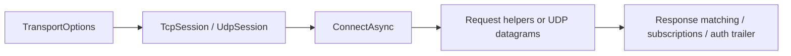

# Nalix.SDK

`Nalix.SDK` is the client-side transport package for connecting .NET applications to a Nalix server over TCP and UDP.

!!! tip "Keep the client simple first"
    Get one working `TcpSession` request flow online before adding handshake policy, directives, localization, or custom request orchestration.

## Client flow



## Core pieces

- `TcpSession`
- `IoTTcpSession`
- `UdpSession`
- `TransportOptions`
- `RequestOptions`
- transport extensions such as `ControlExtensions`, `HandshakeExtensions`, `DirectiveClientExtensions`, and `RequestExtensions`

## Sessions

Use `TcpSession` for the normal client runtime. It includes:

- automatic reconnect with backoff
- heartbeat / keep-alive
- bandwidth sampling
- TaskManager-backed receive and monitor loops

Use `IoTTcpSession` when you want a simpler client shape with a serialized connect path and a lighter receive model.

Use `UdpSession` when you already have a trusted session context and want low-latency datagrams authenticated with the server-side `UdpListenerBase` trailer format.

### Quick example

```csharp
TransportOptions options = ConfigurationManager.Instance.Get<TransportOptions>();
options.Address = "127.0.0.1";
options.Port = 57206;

TcpSession client = new();
await client.ConnectAsync(options.Address, options.Port);
```

## Request and control helpers

The extension layer covers the common client flows:

- `PingAsync`
- `RequestAsync<TResponse>(...)`
- handshake setup
- directive handling such as throttle, redirect, and notice packets

### Quick example

```csharp
var pong = await client.PingAsync();

LoginResponse reply = await client.RequestAsync<LoginResponse>(
    request,
    RequestOptions.Default.WithTimeout(3_000),
    r => r.CorrelationId == request.CorrelationId);
```

The request helpers subscribe before sending, so they avoid the usual response race.

## Transport options

`TransportOptions` belongs to `Nalix.SDK`, even though it is commonly loaded through `ConfigurationManager`.

It controls:

- address and port
- connect timeout
- reconnect policy
- keep-alive interval
- socket tuning
- max packet size
- compression and encryption settings

## Localization

The package also includes optional localization utilities such as:

- `Localizer`
- `MultiLocalizer`
- `PoFile`

These are useful when the client package is reused in desktop or device apps that need localized runtime messages.

## Key API pages

- [SDK Overview](../api/sdk/overview.md)
- [TCP Session](../api/sdk/tcp-session.md)
- [UDP Session](../api/sdk/udp-session.md)
- [Session Extensions](../api/sdk/tcp-session-extensions.md)
- [Request Options](../api/sdk/options/request-options.md)
- [Session Diagnostics](../api/sdk/diagnostics.md)
