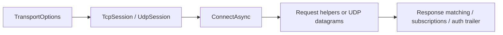

# Nalix.SDK

`Nalix.SDK` is the client-side transport package for connecting .NET applications to a Nalix server over TCP, with an additional UDP session type that is currently marked unsupported in source.

!!! tip "Keep the client simple first"
    Get one working `TcpSession` request flow online before adding directives or custom request orchestration.

## Client flow



## Core pieces

- `TcpSession`
- `IoTTcpSession`
- `UdpSession`
- `TransportOptions`
- `RequestOptions`
- transport extensions such as `ControlExtensions`, `DirectiveClientExtensions`, `RequestExtensions`, and `TcpSessionSubscriptions`

## Sessions

Use `TcpSession` for the normal client runtime. It includes:

- automatic reconnect with backoff
- heartbeat / keep-alive
- bandwidth sampling
- TaskManager-backed receive and monitor loops

Use `IoTTcpSession` when you want a simpler client shape with a serialized connect path and a lighter receive model.

`UdpSession` exists in the source tree, but it is currently marked `Obsolete` and unsupported. Treat it as experimental rather than a default choice.

### Quick example

```csharp
TransportOptions options = ConfigurationManager.Instance.Get<TransportOptions>();
options.Address = "127.0.0.1";
options.Port = 57206;

TcpSession client = new();
await client.ConnectAsync(options.Address, options.Port);
```

## Request and control helpers

The extension layer covers the common client flows:

- `PingAsync`
- `RequestAsync<TResponse>(...)`
- directive handling such as throttle, redirect, and notice packets

### Quick example

```csharp
var pong = await client.PingAsync(opCode: 0, timeoutMs: 3000);

Control request = client.NewControl(opCode: 1, type: ControlType.NOTICE).Build();
Control reply = await client.RequestAsync<Control>(
    request,
    RequestOptions.Default.WithTimeout(3_000),
    r => r.Type == ControlType.PONG);
```

The request helpers subscribe before sending, so they avoid the usual response race.

## Transport options

`TransportOptions` belongs to `Nalix.SDK`, even though it is commonly loaded through `ConfigurationManager`.

It controls:

- address and port
- connect timeout
- reconnect policy
- keep-alive interval
- socket tuning
- max packet size
- compression and encryption settings

## Key API pages

- [SDK Overview](../api/sdk/index.md)
- [TCP Session](../api/sdk/tcp-session.md)
- [UDP Session](../api/sdk/udp-session.md)
- [Session Extensions](../api/sdk/tcp-session-extensions.md)
- [Request Options](../api/sdk/options/request-options.md)
- [Session Diagnostics](../api/sdk/diagnostics.md)
