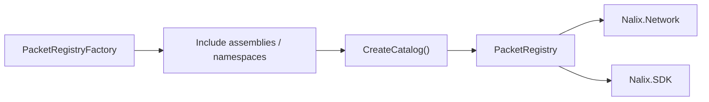

# Nalix.Shared

Shared packet frames, packet registry, and serialization helpers used by both SDK and Network.

## Registry flow



### Purpose
- Define built-in frames.
- Build an immutable packet registry.
- Provide shared serialization helpers.
- Provide pooled LZ4 compression primitives.

### Key components
- `PacketRegistryFactory` — scans packet types and binds deserialize function pointers.
- `PacketRegistry` — frozen catalog of deserializers/transformers.
- `Handshake` — control frame used to establish shared secret and protocol flags.
- `Control` / `Directive` / `Text256/512/1024` — built-in frame types.
- `LZ4Codec` — pooled block compression and decompression.

### Quick example

```csharp
// Build and register the shared catalog
PacketRegistryFactory factory = new();
IPacketRegistry registry = factory.CreateCatalog();
InstanceManager.Instance.Register(registry);

// Handshake frame
Handshake hs = new(0, Csprng.GetBytes(32));
await client.SendAsync(hs.Serialize());
```

### Registry build flow
- Add assemblies or namespaces if you have custom packets.
- Call `CreateCatalog()` once and reuse the result in listeners and clients.

### Quick example

```csharp
PacketRegistryFactory factory = new();
factory.IncludeNamespaceRecursive("MyApp.Packets");
IPacketRegistry catalog = factory.CreateCatalog();
```

## Key API pages

- [Packet Registry](../api/shared/packet-registry.md)
- [Built-in Frames](../api/shared/built-in-frames.md)
- [LZ4](../api/shared/lz4.md)
- [Serialization](../api/shared/serialization.md)
- [Buffer and Pooling](../api/shared/buffer-and-pooling.md)
