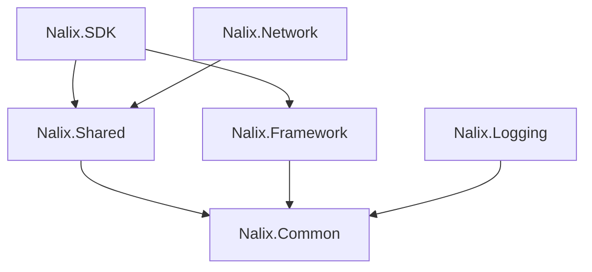

# 📦 Packages Overview

Use these building blocks together or individually depending on your role.

| Package | Use it for | Key types |
| --- | --- | --- |
| Nalix.SDK | Client sessions, handshakes, ping/request helpers | `IoTTcpSession`, `TransportOptions`, `ControlExtensions`, `RequestExtensions` |
| Nalix.Network | Listeners, connection hubs, dispatch pipeline | `TcpListenerBase`, `ConnectionHub`, `PacketDispatchChannel`, `PacketDispatchOptions` |
| Nalix.Common | Shared contracts, packet metadata, middleware | `IPacket`, `IConnection`, `PacketControllerAttribute`, `PacketOpcodeAttribute`, `PacketContext<T>` |
| Nalix.Logging | Structured logging and targets | `NLogix`, `NLogixOptions`, `ILoggerTarget` |
| Nalix.Framework | Configuration, DI, scheduling, time/IDs | `ConfigurationManager`, `InstanceManager`, `TaskManager`, `TimeSynchronizer`, `Snowflake` |
| Nalix.Shared | Built-in frames and packet registry | `PacketRegistryFactory`, `PacketRegistry`, `Handshake`, `Control`, `Text256/512/1024` |

## 🔗 Minimal wiring map

- Client-only: `Nalix.SDK` + `Nalix.Common` + `Nalix.Shared`.
- Server-only: `Nalix.Network` + `Nalix.Common` + `Nalix.Framework` + `Nalix.Shared` (+ `Nalix.Logging` for logs).
- Full stack: all packages; share one `PacketRegistryFactory` catalog via `InstanceManager`.

