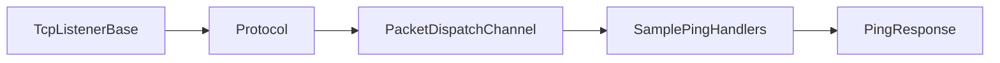

# Quick Start

This page shows the shortest useful server flow:

1. register shared services
2. build dispatch
3. bridge protocol to dispatch
4. start a TCP listener

## Register shared services

```csharp
InstanceManager.Instance.Register<ILogger>(logger);
InstanceManager.Instance.Register<IPacketRegistry>(packetRegistry);
```

## Create a handler

```csharp
[PacketController("SamplePingHandlers")]
public sealed class SamplePingHandlers
{
    [PacketOpcode(0x1001)]
    public ValueTask<PingResponse> Handle(PingRequest request, IConnection connection)
    {
        PingResponse response = new()
        {
            Message = $"pong:{request.Message}"
        };

        return ValueTask.FromResult(response);
    }
}
```

## Build dispatch

```csharp
PacketDispatchChannel dispatch = new(options =>
{
    options.WithLogging(logger)
           .WithHandler(() => new SamplePingHandlers());
});

dispatch.Activate();
```

## Bridge protocol to dispatch

```csharp
public sealed class SampleProtocol : Protocol
{
    private readonly PacketDispatchChannel _dispatch;

    public SampleProtocol(PacketDispatchChannel dispatch) => _dispatch = dispatch;

    public override void ProcessMessage(object sender, IConnectEventArgs args)
        => _dispatch.HandlePacket(args.Lease, args.Connection);
}
```

## Start the listener

```csharp
public sealed class SampleTcpListener : TcpListenerBase
{
    public SampleTcpListener(ushort port, IProtocol protocol) : base(port, protocol) { }
}

SampleTcpListener listener = new(57206, new SampleProtocol(dispatch));
listener.Activate();
```

## Flow at runtime



## What to read next

- [End-to-End Sample](./guides/end-to-end.md)
- [TCP Request/Response](./guides/tcp-request-response.md)
- [Server Blueprint](./guides/server-blueprint.md)
