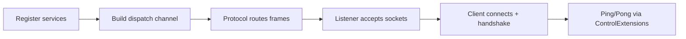

# ⚡ Quick Start

Spin up a minimal listener + client, prove the handshake, and send a ping.

### 🛰️ Flow overview

- One catalog, one dispatcher, one listener.
- One client handshake, one ping/pong.



!!! tip "Checklist"
    - Register `ILogger` and `IPacketRegistry` once.  
    - Attach middleware and a handler.  
    - Derive `Protocol` + `TcpListenerBase` to bridge sockets into the dispatcher.  
    - Connect the client, send `Handshake`, then `PingAsync`.

### 🏗️ Listener setup

Derive a protocol and listener that forward frames into the dispatch channel.

**Do this**
- Register shared services.
- Add middleware + handler.
- Derive `Protocol` and `TcpListenerBase`.

```csharp
InstanceManager.Instance.Register<ILogger>(NLogix.Host.Instance);
IPacketRegistry registry = new PacketRegistryFactory().CreateCatalog();
InstanceManager.Instance.Register(registry);

PacketDispatchChannel channel = new(options =>
{
    options.WithMiddleware(new TimeoutMiddleware());
    options.WithHandler(() => new HandshakeHandlers());
});

sealed class DemoProtocol : Protocol
{
    private readonly PacketDispatchChannel _dispatch;
    public DemoProtocol(PacketDispatchChannel dispatch) => _dispatch = dispatch;
    public override void ProcessMessage(object sender, IConnectEventArgs args)
        => _dispatch.HandlePacket(args.Lease, args.Connection);
}

sealed class DemoListener : TcpListenerBase
{
    public DemoListener(ushort port, IProtocol protocol) : base(port, protocol) { }
}

DemoProtocol protocol = new(channel);
DemoListener listener = new(57206, protocol);

channel.Activate();
listener.Activate();
```

**Expected output**
```
[NW.TcpListenerBase] port=57206 state=Running backlog=512
Dispatch: middleware=2 handlers=1
```

### 🧩 Handler example

Handlers are discovered via attributes and run inside the dispatch pipeline.

```csharp
[PacketController("HandshakeHandlers")]
public class HandshakeHandlers
{
    [PacketOpcode(1)]
    public ValueTask Handle(Handshake packet, IConnection connection)
        => connection.SendAsync(packet);
}
```

### 🤝 Client handshake

Connect with the SDK and prove both sides share the same secret.

```csharp
TransportOptions options = ConfigurationManager.Instance.Get<TransportOptions>();
options.Address = "127.0.0.1";
options.Port = 57206;

IoTTcpSession client = new();
await client.ConnectAsync(options.Address, options.Port);

Handshake handshake = new(0, Csprng.GetBytes(32));
await client.SendAsync(handshake.Serialize());
```

### 🔁 Ping and request
Use SDK helpers that register awaiters before sending.

```csharp
await ControlExtensions.PingAsync(client, CancellationToken.None);
```

```csharp
Control ctrl = client.NewControl(3, ControlType.PING).WithSeq(42).Build();
Control pong = await RequestExtensions.RequestAsync<Control>(
    client,
    ctrl,
    RequestOptions.Default,
    p => p.Type == ControlType.PONG);
```
