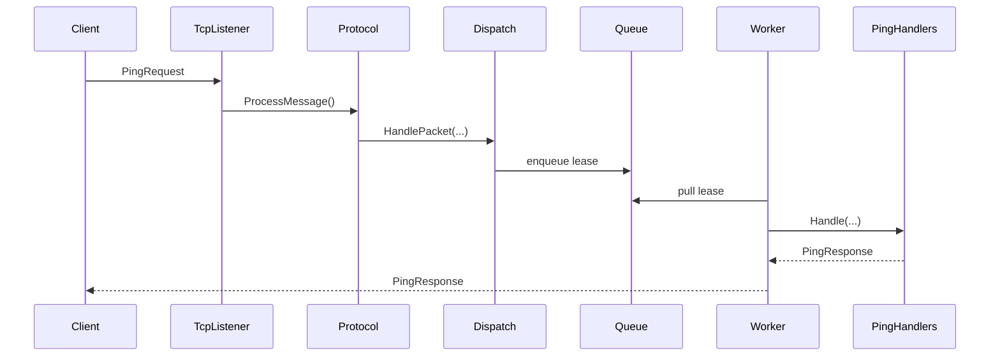

# Quickstart

Run one TCP ping request end to end.

## Install

### Shared contracts

```bash
dotnet add package Nalix.Common
dotnet add package Nalix.Framework
```

### Server

```bash
dotnet add package Nalix.Common
dotnet add package Nalix.Framework
dotnet add package Nalix.Network
dotnet add package Nalix.Logging
```

### Client

```bash
dotnet add package Nalix.Common
dotnet add package Nalix.Framework
dotnet add package Nalix.SDK
```

## Project Structure

```text
QuickStart/
  src/
    QuickStart.Contracts/
      Packets/
        PingRequest.cs
        PingResponse.cs
    QuickStart.Server/
      Handlers/PingHandlers.cs
      Listeners/QuickStartTcpListener.cs
      Protocols/QuickStartProtocol.cs
      Program.cs
    QuickStart.Client/
      Program.cs
```

Reference `QuickStart.Contracts` from both server and client.

## 1. Packets

### `PingRequest.cs`

```csharp
using Nalix.Common.Networking.Packets;
using Nalix.Common.Networking.Protocols;
using Nalix.Common.Serialization;
using Nalix.Framework.DataFrames;

namespace QuickStart.Contracts.Packets;

[SerializePackable(SerializeLayout.Explicit)]
public sealed class PingRequest : PacketBase<PingRequest>
{
    public const ushort OpCodeValue = 0x1001;

    [SerializeDynamicSize(64)]
    [SerializeOrder(PacketHeaderOffset.Region)]
    public string Message { get; set; } = string.Empty;

    public PingRequest()
    {
        this.OpCode = OpCodeValue;
        this.Protocol = ProtocolType.TCP;
        this.Flags = PacketFlags.SYSTEM;
    }
}
```

### `PingResponse.cs`

```csharp
using Nalix.Common.Networking.Packets;
using Nalix.Common.Networking.Protocols;
using Nalix.Common.Serialization;
using Nalix.Framework.DataFrames;

namespace QuickStart.Contracts.Packets;

[SerializePackable(SerializeLayout.Explicit)]
public sealed class PingResponse : PacketBase<PingResponse>
{
    public const ushort OpCodeValue = 0x1002;

    [SerializeDynamicSize(64)]
    [SerializeOrder(PacketHeaderOffset.Region)]
    public string Message { get; set; } = string.Empty;

    public PingResponse()
    {
        this.OpCode = OpCodeValue;
        this.Protocol = ProtocolType.TCP;
        this.Flags = PacketFlags.SYSTEM;
    }
}
```

## 2. Server

### `PingHandlers.cs`

```csharp
using Nalix.Common.Networking;
using Nalix.Common.Networking.Packets;
using Nalix.Network.Routing;
using QuickStart.Contracts.Packets;

namespace QuickStart.Server.Handlers;

[PacketController("PingHandlers")]
public sealed class PingHandlers
{
    [PacketOpcode(PingRequest.OpCodeValue)]
    public IPacket Handle(PacketContext<IPacket> request)
    {
        PingRequest packet = (PingRequest)request.Packet;
        return new PingResponse { Message = $"pong: {packet.Message}" };
    }
}
```

### `QuickStartProtocol.cs`

```csharp
using Nalix.Common.Networking;
using Nalix.Network.Protocols;
using Nalix.Network.Routing;

namespace QuickStart.Server.Protocols;

public sealed class QuickStartProtocol : Protocol
{
    private readonly PacketDispatchChannel _dispatch;

    public QuickStartProtocol(PacketDispatchChannel dispatch)
    {
        _dispatch = dispatch;
        this.SetConnectionAcceptance(true);
        this.KeepConnectionOpen = true;
    }

    public override void ProcessMessage(object? sender, IConnectEventArgs args)
        => _dispatch.HandlePacket(args.Lease, args.Connection);
}
```

### `QuickStartTcpListener.cs`

```csharp
using Nalix.Common.Networking;
using Nalix.Network.Listeners.Tcp;

namespace QuickStart.Server.Listeners;

public sealed class QuickStartTcpListener : TcpListenerBase
{
    public QuickStartTcpListener(ushort port, IProtocol protocol) : base(port, protocol) { }
}
```

### `Program.cs`

```csharp
using Nalix.Common.Diagnostics;
using Nalix.Common.Networking.Packets;
using Nalix.Framework.DataFrames;
using Nalix.Framework.Injection;
using Nalix.Logging;
using Nalix.Network.Routing;
using QuickStart.Contracts.Packets;
using QuickStart.Server.Handlers;
using QuickStart.Server.Listeners;
using QuickStart.Server.Protocols;

const ushort Port = 57206;

ILogger logger = NLogix.Host.Instance;
IPacketRegistry packetRegistry = new PacketRegistry(factory =>
{
    factory.RegisterPacket<PingRequest>()
           .RegisterPacket<PingResponse>();
});

InstanceManager.Instance.Register<ILogger>(logger);
InstanceManager.Instance.Register<IPacketRegistry>(packetRegistry);

using PacketDispatchChannel dispatch = new(options =>
{
    options.WithLogging(logger)
           .WithHandler<PingHandlers>();
});

using QuickStartProtocol protocol = new(dispatch);
using QuickStartTcpListener listener = new(Port, protocol);

dispatch.Activate();
listener.Activate();

Console.WriteLine($"Server running on tcp://127.0.0.1:{Port}");
Console.WriteLine("Press ENTER to stop.");
Console.ReadLine();

listener.Deactivate();
dispatch.Deactivate();
```

## 3. Client Test

### `Program.cs`

```csharp
using Nalix.Common.Networking.Packets;
using Nalix.Framework.DataFrames;
using Nalix.SDK.Configuration;
using Nalix.SDK.Transport;
using Nalix.SDK.Transport.Extensions;
using QuickStart.Contracts.Packets;

const ushort Port = 57206;

IPacketRegistry packetRegistry = new PacketRegistry(factory =>
{
    factory.RegisterPacket<PingRequest>()
           .RegisterPacket<PingResponse>();
});

TransportOptions transport = new()
{
    Address = "127.0.0.1",
    Port = Port
};

await using TcpSession client = new(transport, packetRegistry);
await client.ConnectAsync();

PingResponse response = await client.RequestAsync<PingResponse>(
    new PingRequest { Message = "hello" },
    RequestOptions.Default.WithTimeout(3_000));

Console.WriteLine($"Server replied: {response.Message}");

await client.DisconnectAsync();
```

Run:

```bash
dotnet run --project src/QuickStart.Server
dotnet run --project src/QuickStart.Client
```

Expected output:

```text
Server replied: pong: hello
```

## Runtime Flow



## Quick Notes

- Register `IPacketRegistry` before creating `PacketDispatchChannel`.
- Keep `QuickStart.Contracts` shared by both sides.
- `SetConnectionAcceptance(true)` is required.
- `KeepConnectionOpen = true` keeps the session alive after the first reply.

## Next Steps

1. [TCP Request/Response](./guides/tcp-request-response.md)
2. [Server Blueprint](./guides/server-blueprint.md)
3. [Custom Middleware End-to-End](./guides/custom-middleware-end-to-end.md)
